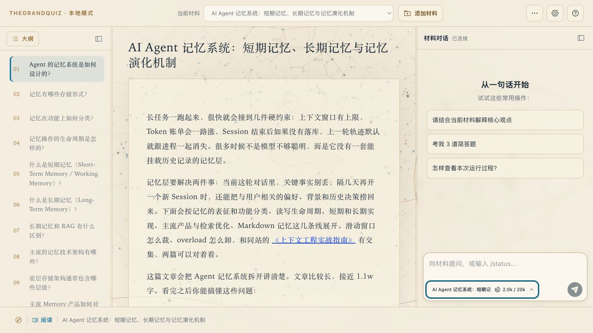
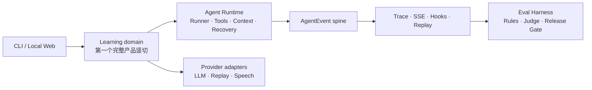
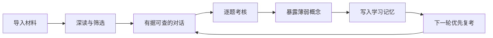

<div align="center">

<picture>
  <source media="(prefers-color-scheme: dark)" srcset="docs/assets/brand/zhengkaoji-logo-primary-dark.png">
  <source media="(prefers-color-scheme: light)" srcset="docs/assets/brand/zhengkaoji-logo-primary-light.png">
  
</picture>

<h1>正考级 · TheGrandQuiz</h1>

<p><strong>俺们老中最会的就是考</strong></p>

<p><strong>Product-first learning agent. Harness-grade internals.</strong></p>

<p>
  一个考核驱动、可追溯、local-first 的个人学习 Agent，<br>
  由可观测 Agent Runtime、Trace/Replay 与 Eval Harness 提供工程支撑。
</p>

<p>
  <a href="https://github.com/Hyr1sky/TheGrandQuiz/actions/workflows/ci.yml"></a>
  <a href="https://www.python.org/"></a>
  <a href="#数据与外部服务"></a>
  <a href="LICENSE"></a>
</p>

</div>

<p align="center">
  
</p>

> **正考级不只是帮你读完材料。** 它通过有证据的对话和逐题考核，找出掌握得似是而非的
> 地方，把薄弱概念记下来，并在下一轮优先复考。
> 非常遗憾的灵感来源，在经历了这么多年的教育之后，最高效的记忆方法可能还是考。

## 不只是另一个聊天套壳

TheGrandQuiz 是一个真实学习产品，也是 Agent 工程能力的完整竖切：学习者看到的是材料入库、对话、考核、
薄弱点记忆与语音回答；底层则用同一条事件脊柱连接执行、观测、恢复、回放和评测。

| 面向学习者 | 面向 Agent 工程 |
| --- | --- |
| **Grounded Learning**：对话、题目、判决都能回到材料 Evidence | **Agent Runtime**：事件驱动执行、工具循环、上下文预算、审批与恢复 |
| **Assessment Loop**：逐题暴露薄弱点，下一轮优先复考 | **Trace / Replay**：运行树、token、错误与确定性离线回放 |
| **Reviewable Voice**：ASR 先生成可编辑草稿，不替用户直接作答 | **Eval Harness**：规则断言、语义 Judge、人工校准、配对实验与发布门 |
| **Local-first**：学习状态、Trace 与草稿保存在本机 SQLite | **HITL by design**：材料审批、判决纠正与候选晋升都保留人工控制 |



## 一条真正闭合的学习回路



Runtime 原语可以在源码内复用于新的领域竖切，但当前还不是可运行时安装的插件系统，也不承诺稳定的第三方
Plugin API。`domain.learning` 是第一个经过真实产品、Trace 与 Eval 共同验证的领域实现；只有出现第二个真实
领域消费者后，项目才会从共同变化中提炼公开扩展契约。

## v0.5.0 能做什么

| 能力 | 当前体验 | 工程保证 |
| --- | --- | --- |
| **材料入库** | CLI 或 Web 上传 Markdown / Text，也可导入公开 URL | 深读后人工筛选；拒绝或失败不会留下半份知识快照 |
| **材料发现** | 按主题搜索候选，再选择是否抓取与深读 | Search 不等于 Fetch；批准前不调用 Reader、不写知识库 |
| **材料对话** | 通过 CLI ReAct 或 Local Web 围绕当前材料提问 | exact scope，不能静默扩大到全库 |
| **逐题考核** | 选择题、开放问答、薄弱点复考；开放题可提交一次补充说明 | LLM 逐点评判，代码聚合、记账并以追加事实修正状态 |
| **语音作答** | 桌面 Chromium 录音，转写后先审查/编辑再提交 | 原始音频不落盘；VoiceRun 幂等、可取消、可重试并接入既有 Assessment |
| **精确 Evidence** | 从答案和考题回到原文依据 | 定位到 revision / node / source span |
| **学习记忆** | 记录暴露出的薄弱概念 | 下一轮选题优先复考，而非只存聊天记录 |
| **可纠正学习事实** | 审查答题记录、分类和判决纠正 | append-only Journal/outbox，可重建投影 |
| **本地 Eval 数据闭环** | 审核纠正/盲标候选并固定不可变数据集快照 | 隐私审核、来源身份和 release-eligible / exploratory 强制分层 |
| **可信运行** | 浏览 trace、执行树、token、错误与恢复状态 | Record/Replay + 17 条离线 Eval |
| **Local Web** | 可调三栏、连续文章、Chat `/status`、设置、Evidence 与考核 | 同源 SPA、安全 Markdown、稳定 SSE、可见上下文预算 |

> [!NOTE]
> v0.5.0 是**本机单用户版本**，不支持账号、多用户、云同步或公网服务。Web 已提供材料发现、导入与
> 可恢复审批，但完整的文章/知识点维护操作和连续“掌握度分数”仍属于后续版本；现有 Web 服务也
> 不应直接暴露到局域网或公网。

## 数据与外部服务

TheGrandQuiz 默认把数据保存在本机：

```text
~/.grandquiz/learning.db   # 材料、revision、KnowledgeItem、Evidence、Learning Memory
~/.grandquiz/trace.db      # 用户消息、模型/工具事件、token、错误与执行树
~/.grandquiz/voice.db      # 短期 VoiceRun 草稿与 Provider attempt；终态/过期后清除正文
~/.grandquiz/eval-report/  # 离线 Eval HTML
```

配置真实 LLM 后，system prompt、用户消息、选定材料节点和工具上下文会发送给 `.env` 中配置的
OpenAI-compatible 服务。不要导入无权发送给该服务的私人、受限或机密材料。

Web Search 只是返回候选，不代表允许抓取或入库；选中 URL 后的内容仍按不可信输入处理，并经过
大小、域名、质量、prompt-injection 和人工审批边界。Trace 不保存完整抓取网页正文，但可能包含
用户消息、工具参数、模型输出和引用片段，因此也应按敏感数据保护。

默认 Web 服务只监听 `127.0.0.1`，没有账号或鉴权。不要把它直接暴露到局域网或公网。完整安全模型、
漏洞报告和密钥处理见 [SECURITY.md](SECURITY.md)。

## Quickstart

### 1. 准备环境

需要 Python 3.12+、[uv](https://docs.astral.sh/uv/) 和一个 OpenAI-compatible LLM。Docker 不是基础依赖；
只有选择自托管 SearXNG 时才需要。

```bash
git clone https://github.com/Hyr1sky/TheGrandQuiz.git
cd TheGrandQuiz
uv sync
cp .env.example .env
```

编辑 `.env`。`LLM_*` 是 basic 角色（判卷、基础判断），`ENRICH_LLM_*` 是 enrich 角色（Reader、出题）。
两个角色可以指向同一个 provider/model，但仍需分别填写两组变量，避免隐藏 fallback。

语音答题是可选能力：配置 `DASHSCOPE_API_KEY` 后，桌面 Chromium 的开放题会出现录音入口。机器转写只会
生成可编辑草稿，不会自动提交；材料词表可在 Web 设置中开关。

### 2. 导入第一份材料

建议先用你有权处理的本地 Markdown 或纯文本：

```bash
uv run grandquiz ingest ./notes/agent-runtime.md --task "Agent Runtime"
```

Reader 会展示候选 KnowledgeItem；只有你确认保留的条目才会原子写入知识库。拒绝或失败不会留下半份
知识快照。也可以先启动 Local Web，再从顶栏“添加材料”上传 `.md` / `.markdown` / `.txt` 或输入公开
网页 URL；处理状态和候选审批会保存在 `learning.db`，服务重启后仍可在原浏览器恢复。

### 3. 对话或考核

```bash
uv run grandquiz react "Agent Runtime 学习"
uv run grandquiz quiz "Agent Runtime 复习" --rounds 3
```

`title` 只是本次会话横幅，不划分知识库或材料范围。需要指定材料时，在 ReAct 中明确选择，Web 中以顶栏
“当前材料”为 exact scope。

### 4. 查看 Trace 与离线 Eval

每次运行结束会打印 `trace_id`：

```bash
uv run grandquiz trace <trace_id>
uv run grandquiz report
```

`report` 使用安装包自带的 Replay cassette，默认不读取 `.env`、不访问公网、不调用真实模型。

### 5. 启动 Local Web

已安装的 package 或仓库环境都可以用一条命令启动同源生产工作台：

```bash
uv run grandquiz-web
```

浏览器打开 `http://127.0.0.1:8000`。服务同时提供打包后的 React 页面与 `/api/v1`，并且只监听
loopback。Web 可完成上传/URL 导入、状态观察、候选知识点审批与失败/取消重试；CLI 继续作为批量 ingest、
恢复和 trace 审计入口。完整的资源删除、revision/知识点维护仍不在 v0.5 范围内。

修改前端源码时再使用两个终端进入开发模式：

```bash
# terminal 1
uv run grandquiz-web

# terminal 2
cd web
npm ci
npm run dev
```

开发页面位于 `http://127.0.0.1:5173`，Vite 把 API 请求代理到本地后端。

## 可选 Web Search

不配置 Search provider 时，本地材料、Chat、Quiz 和 Eval 都可正常使用。

- Tavily：在 `.env` 设置 `TAVILY_API_KEY`；
- SearXNG：按 [deploy/searxng/README.md](deploy/searxng/README.md) 启动本机服务并设置
  `SEARXNG_URL`；
- 两者同时存在时必须设置 `WEB_SEARCH_PROVIDER=tavily|searxng`，避免静默切换供应商。

可先只搜索候选，不调用 LLM、不抓取或入库：

```bash
uv run grandquiz search "MySQL 面试高频考点"
```

## 备份、恢复与清除

操作数据库前先停止 CLI/Web 进程。备份整个数据目录可以同时保留学习状态与 trace：

```bash
cp -a ~/.grandquiz ~/.grandquiz-backup
```

恢复时先保留当前目录，再把备份复制回来。需要清除本地数据时，优先把目录移动到一个可恢复的位置，
确认无误后再由操作系统删除：

```bash
mv ~/.grandquiz ~/.grandquiz-retired
```

删除 `.env` 只会移除本机配置，不会撤销已经发送给外部服务的数据；外部服务的数据保留规则由其供应商决定。

## 开发与质量门

```bash
uv sync --dev
uv run ruff check .
uv run ruff format --check .
uv run pyright
uv run lint-imports
uv run pytest
uv run python -m grandquiz.evals

cd web
npm ci
npm run lint
npm run api:check
npm test
npm run typecheck
npm run build:package
npm run test:sites
npm run test:e2e
```

本地 Playwright 默认复用已安装的稳定版 Chrome，避免因 Playwright 浏览器 revision 更新反复下载大体积
Chromium；CI 仍安装并使用固定 Chromium。需要在本地验证固定 Chromium 时，可先执行
`npx playwright install chromium`，再以 `GRANDQUIZ_SYSTEM_CHROME=0 npm run test:e2e` 运行。

CI 在每次 push / PR 上运行 Python、Eval、Web、OpenAPI 和 Playwright 门。贡献约定、cassette 重录纪律和
PR 要求见 [CONTRIBUTING.md](CONTRIBUTING.md)。

## 架构与项目资料

代码按 `kernel / providers / domain / interfaces / evals` 分层。`kernel` 不依赖学习领域；产品入口和 Eval
仍显式组合 `domain.learning`，避免在没有第二个消费者前提前设计一套名义上的通用插件框架。

| 文档 | 内容 |
| --- | --- |
| [docs/index.md](docs/index.md) | 文档导航、职责边界与冲突优先级 |
| [docs/product.md](docs/product.md) | 用户问题、核心循环、产品原则与版本边界 |
| [CONTEXT.md](CONTEXT.md) | 产品领域语言权威表 |
| [docs/domain-model.md](docs/domain-model.md) | 当前实体、不变量与 Learning Model v2 数据契约 |
| [docs/vocabulary.md](docs/vocabulary.md) | 分层受控词表与审核治理 |
| [docs/architecture.md](docs/architecture.md) | 分层、事件脊柱与核心设计判断 |
| [docs/roadmap.md](docs/roadmap.md) | 后续阶段与验收顺序 |
| [docs/adr/](docs/adr/) | 不可逆架构决策 |
| [docs/devrecords/](docs/devrecords/) | 实现、dogfood、成本与门禁记录 |
| [docs/releases/v0.5.0.md](docs/releases/v0.5.0.md) | v0.5.0 发布说明与已知限制 |
| [docs/open-source-release-checklist-v0.5.0.md](docs/open-source-release-checklist-v0.5.0.md) | v0.5.0 发布门 |

## 反馈与合作

v0.5.0 仍是个人维护的早期版本：核心学习闭环已经可用，但判卷校准、资源维护和个性化学习策略还有很长的
深化空间。如果你有好的 idea、真实学习场景或不佳体验，欢迎在 issue 中讨论；Bug 请尽量附上版本、
最小复现和脱敏后的 `trace_id`。

## 社区

本项目在 [LINUX DO](https://linux.do/) 社区进行开源交流与推广，感谢社区提供的交流、反馈与共建环境。

## 许可证

TheGrandQuiz 以 [MIT License](LICENSE) 发布，Copyright © 2026 Hyr1sky。允许个人与商业使用、
修改、再发布和闭源集成，但必须保留原版权与许可证文本。

依赖与打包资产继续适用各自许可证；第三方声明随对应分发物一同提供。

> Powered by Codex, Claude Code and Hyr1sky's 🧠.
