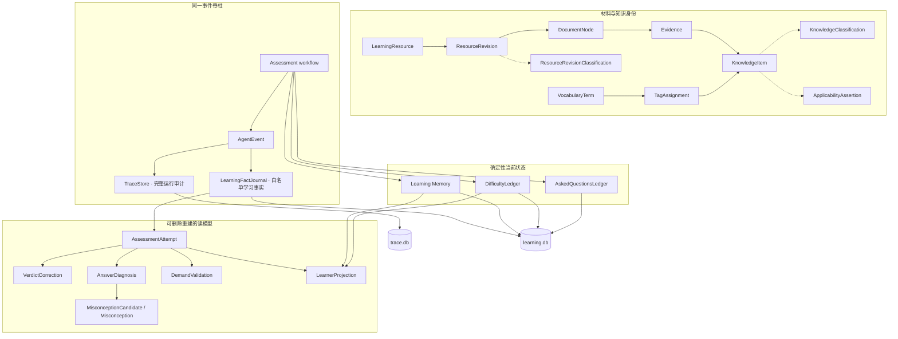

# 领域模型

Status: current model + implemented Learning Model v2 foundation

本文件负责实体、契约和不变量。术语的简短定义以 [CONTEXT.md](../CONTEXT.md) 为准；不可逆取舍以
[ADR](adr/) 为准；代码模块归属见 [architecture.md](architecture.md)。

## 当前写侧真相

```text
LearningResource
  └─ current ResourceRevision（旧 revision 不可变保留）
       └─ DocumentNode tree
            └─ exact Evidence
                 └─ KnowledgeItem（资源内学习身份）

QUESTION_ASKED + ANSWER_JUDGED
  ├─ Learning Memory（三态薄弱状态）
  ├─ DifficultyLedger（每 item 1–5 档题目难度）
  └─ AskedQuestionsLedger（跨会话题目历史）
```

| 对象 | 当前职责 | 身份或关键不变量 |
| --- | --- | --- |
| `LearningResource` | 稳定指向一份材料 | locator 稳定；内容变化不改 resource identity |
| `ResourceRevision` | 保存一次获批内容 | 不可变；历史 trace 始终解析到原 revision |
| `DocumentNode` | 表达原文结构和 source span | 文档结构边不是知识关系 |
| `Evidence` | 把知识与回答锚定到原文 | quote 必须逐字验证；无法解析时标记 unresolved，不猜测 |
| `KnowledgeItem` | 最小可考知识单元 | 资源内唯一；跨资源暂不合并 |
| `Learning Memory` | 保存薄弱 → 观察中 → 销账状态 | 只由确定性判决后果更新；不是连续掌握度 |
| `DifficultyLedger` | 调整每个 item 的题目难度 | 1–5 离散档；不等于用户掌握度 |
| `AskedQuestionsLedger` | 避免跨会话机械重复 | 与薄弱状态、难度分别演化 |
| `AssessmentPlan` | 把多题请求规范化为逐位置题型意图 | 1–20 题；顺序不可丢；所有 interface 共用 |
| `QuestionSpec` | 保存单道开放题的题干、评分点、参考作答与 Evidence | 每个评分点 ID 唯一且锚定本题 Evidence；Grader 不读取题外 rubric |

## 整体蓝图



### 五层职责

| 层 | 回答的问题 | 代表对象 | 权威性质 |
| --- | --- | --- | --- |
| 材料与证据 | 原文是什么、知识从哪里来 | ResourceRevision、DocumentNode、Evidence、KnowledgeItem | 当前写侧真相 |
| 分类与词表 | 这是什么类型、属于哪些受控主题 | Classification、ApplicabilityAssertion、Vocabulary、TagAssignment | 可审核、可修订事实 |
| 考核事实 | 问过什么、答了什么、如何判、是否纠正 | LearningFactJournal、AssessmentAttempt、VerdictCorrection | append-only 事实 + 可重建投影 |
| 操作状态 | 下一题现在应该如何选择和调难度 | Learning Memory、DifficultyLedger、AskedQuestionsLedger | 确定性当前状态 |
| 分析读模 | 学过什么、错因和能力证据是什么 | Diagnosis、Misconception、DemandValidation、LearnerProjection | 可删除、可重建，不反写状态 |

`TraceStore` 横跨所有运行阶段，但只负责完整审计；它不是长期学习事实的唯一存储。
[ADR-0010](adr/0010-durable-learning-facts-separate-from-operational-trace.md) 固定了两个事件消费者的
保留边界。

## Learning Model v2 的边界

v2 的目标是连接“材料是什么、考过什么、错在哪里、后续如何观察”，不另建第二套 Learning Memory、
DifficultyLedger 或已问题目真相。

```text
KnowledgeItem ──→ KnowledgeClassification

assessment span + learning events
             └──→ LearningFactJournal
                       └──→ AssessmentAttempt（可重建事实投影）
                       ├──→ VerdictCorrection（追加纠正）
                       ├──→ AnswerDiagnosis（可审核模型建议）
                       │       └──→ MisconceptionCandidate
                       │               └──→ Misconception（可撤销投影）
                       └──→ LearnerProjection（可删除读模型）

VocabularyTerm ──→ TagAssignment
       └──────────→ TagCandidate（待审核，不驱动行为）
```

### 成熟度

`current` 表示已有真实写入与读取消费者；`foundation` 表示契约、持久化与审核机制已存在，但尚不驱动
筛选、选题或 Web 产品行为；`future` 只记录语义，不进入 migration、OpenAPI 或运行时模型。

| 契约 | 状态 | 第一消费者 |
| --- | --- | --- |
| `AssessmentAttemptV1` | current | 学习历史 API、纠错与 Eval |
| `VerdictCorrectionV1` | current | 申诉审计与状态 reconciliation |
| `DemandValidationV1` | current（仅人工） | 认知要求投影；自动 Judge gated |
| `LearnerProjectionV1` | current（窄投影） | 可解释统计与本地报告 |
| `LearningFactJournalV1` | current | 长期学习事实与投影重建 |
| `KnowledgeClassificationV1` | foundation | 入库规则 proposal 与人工审核 |
| `ResourceRevisionClassificationV1` | foundation | 材料体裁记录；尚无筛选消费者 |
| `VocabularyTermV1` / assignments / candidates | foundation | 词表审核；尚不驱动选题 |
| `ApplicabilityAssertionV1` | future | 有证据的产品、版本与环境适用范围 |
| `AnswerDiagnosisV1` | future | 错因复盘；不直接写 Learning Memory |
| `MisconceptionCandidateV1` / `MisconceptionV1` | future | 持久错误心智模型的审核与回顾 |

## 封闭分类维度

封闭维度只能引用版本化词表；新增值必须同时修改契约、迁移/兼容策略和 Eval。

| 维度 | 初始值 |
| --- | --- |
| `KnowledgeKind` | concept, mechanism, procedure, method, tradeoff, failure_mode, case |
| `KnowledgeOrientation` | theory, practice；允许同时存在 |
| `QuestionFormat` | multiple_choice, open_response |
| `QuestionStrategy` | standard, probe |
| `InputModality` | text, voice |
| `AnswerFormat` | choice, natural_language, code |
| `CognitiveDemand` | recall, explain, compare, apply, diagnose, evaluate, design |
| `ErrorKind` | unknown, incomplete, confusion, misapplication, missing_prerequisite, unsupported, overgeneralization, outdated, communication |
| `ClassificationSource` | rule, model, user |
| `ReviewStatus` | proposed, approved, rejected |
| `LifecycleStatus` | active, superseded, retracted |

定义、使用边界和初始 managed term 见
[机器可读词表](vocabulary.v1.yaml) 与 [治理规则](vocabulary.md)。

## 候选契约

### KnowledgeClassificationV1

```text
schema_version, taxonomy_version
classification_id, item_id, revision, supersedes_id
primary_kind: KnowledgeKind
orientations: set[KnowledgeOrientation]
classified_by
review_status, lifecycle_status, trace_id
```

分类变化不改变 `KnowledgeItem.item_id`。`KnowledgeClassification` 不嵌入 managed tag；
每个 item 只有一个 `primary_kind`，v1 不增加 secondary kinds：只有当多个主张可以独立考核且 Evidence
可分离时才拆 item，否则选择主导 kind。确定性规则只产生 `proposed` classification；`approved` 保留给
人工审核或未来通过独立 Eval gate 的规则版本。修改分类内容时追加 classification revision 并 supersede
旧 revision；对既有 proposal 的批准/拒绝会追加审核事实，同时更新当前查询投影，不把状态投影
误称为新的分类内容 revision。

### ResourceRevisionClassificationV1

```text
schema_version, taxonomy_version
classification_id, revision_id, revision, supersedes_id
primary_source_genre: SourceGenre
classified_by
review_status, lifecycle_status, trace_id
```

来源体裁属于不可变 ResourceRevision，不在每个 KnowledgeItem 重复保存。KnowledgeItem 读取时继承其
revision 的 genre；section / table / code 等局部形态继续由 `DocumentNode.node_type` 表达。教程中的
代码块不会把整个 revision 变成 source_code。

### ApplicabilityAssertionV1

```text
schema_version, taxonomy_version
assertion_id, item_id, revision, supersedes_id
scope:
  product_term_ids[]
  version_constraints[{subject_term_id, scheme, expression}]
  environment_term_ids[]
supporting_evidence, asserted_by, confidence
review_status, lifecycle_status, trace_id
```

Applicability 是 item-level、source-grounded 的独立断言，不属于 KnowledgeClassification。一个 scope
内部的非空约束按 AND 解释，多条 approved assertion 之间按 OR 解释。未提供 assertion 或某个维度为空
都表示 `unspecified`，不能推断为全版本/全环境适用。version 必须声明 semver、named_release 或 opaque
等 scheme；v1 只保留契约，不接入选题或判卷。

### TagAssignmentV1

```text
schema_version, taxonomy_version
assignment_id, subject_type, subject_id, term_id, revision, supersedes_id
assigned_by, review_status, lifecycle_status, trace_id
```

领域、技术等受控增长标签只通过 TagAssignment 关联；它是 managed term 关联的唯一真相。只有 approved
assignment 进入默认产品投影，API 可以在读取时合并展示，但不能把 term key 反写进
`KnowledgeClassification`。

### LearningFactJournalV1

```text
schema_version: learning-fact-envelope.v1
event_id, event_type, entity_id
trace_id, source_event_seq
payload_schema_version, taxonomy_version
redaction_profile, payload
```

Journal 是同一 AgentEvent 脊柱的白名单消费者，写入 `learning.db`。它只接收 assessment committed 后的
长期学习事实，并通过 transaction/outbox 与三本 operational ledger 保持一致；完整 prompt、工具 payload、
token 与普通 Chat 仍只属于 trace。AssessmentAttempt 从 Journal 重建，删除 trace 后仍可恢复。

从 Journal 生成的 JSONL/Markdown 只是带 manifest、cursor、hash 与 redaction profile 的本地审查导出，
不是第三套事实源或数据库备份。规则见
[ADR-0010](adr/0010-durable-learning-facts-separate-from-operational-trace.md)。

### AssessmentAttemptV1

```text
schema_version, taxonomy_version
attempt_id := deterministic(trace_id + assessment_span_id)
trace_id, assessment_span_id, item_id
question_text
adaptive_route: {format: QuestionFormat, strategy: QuestionStrategy}
effective_route: {format: QuestionFormat, strategy: QuestionStrategy}
routing_source: adaptive | user_override
input_modality: InputModality
answer_format: AnswerFormat
answer_text, initial_verdict, final_verdict
concept_state, evidence_revealed_before_answer, elapsed_ms
question_generation: {kind: rule | model, version}
grading: {kind: deterministic | model, version}
appeal_status, active_demand_validation_id
source_event_cursor: {first_seq, last_seq}
```

Attempt 是 assessment span 内事件的物化投影，不是新的判卷写入口。`initial_verdict` 同时覆盖代码判卷和
LLM 判卷的原始结果；`final_verdict` 初始与其相等，若申诉成立则追加裁决并保留原判断。确定性 grader
必须携带规则版本，例如 `multiple-choice-exact.v1`。第一阶段按需
离线重建；只有查询性能出现真实需求时才增加
`assessment_attempts` 缓存表，并且该表必须支持从事件全量删除重建。

当前三种内部题型稳定映射为：

```text
选择题 → multiple_choice + standard
开放   → open_response + standard
追问   → open_response + probe
```

题面格式与追问策略彼此独立。输入媒介与答案形态也彼此独立：语音回答是
`input_modality=voice + answer_format=natural_language`，代码回答不是新的输入媒介。
Attempt 只保存当前 approved validation 的 ID，不嵌入第二份可修订对象。

当前 Attempt 不保存 `intended_demand`。未来如果出题路由真实产生这一字段，它仍只能表示计划，不能直接
证明题目实际考到了该能力；能力投影只读取 approved DemandValidation。

现有事件已经提供题目、答案、判决、Evidence、状态变化和 span 边界，第一阶段可离线重建：

```text
assessment.started
→ learning.question_asked
→ learning.answer_judged
→ learning.concept_state_changed
→ learning.difficulty_tier_changed?
→ assessment.ended
```

当前已存在 input modality / answer format、Evidence reveal 与 appeal 纠错。运行时判卷已生产受控
`diagnosis` 以及 matched/missing points，并由 CLI/Web 消费；它们目前只属于题后反馈与完整 Trace，
尚未晋升为 `AnswerDiagnosisV1` 长期学习事实。`confidence_before`、hint、intended demand 和持久化
AnswerDiagnosis 尚无完整生产者—消费者闭环，只保留在后文 future 蓝图；
未来应通过 additive event 扩展，而不是更改既有事件顺序或赋予旧字段新含义。

### DemandValidationV1

```text
schema_version: demand-validation.v1
validation_id, attempt_id, revision, supersedes_id
validated_demand: CognitiveDemand | null
validator_kind: rule | calibrated_judge | user
validator_version, calibration_version
rationale
review_status, lifecycle_status, trace_id
```

LLM validator 的输入必须 mask `intended_demand`、生成器自报标签和 learner answer，只读取题目、
选项/参考答案、rubric 与 grounding Evidence；它从封闭集合中选择一个主要 demand，无法可靠判断时返回
null。该调用使用独立契约与 span，可复用 provider，但不能冒充生产判卷或 Eval QualityJudge。只有在人工
标注集上完成校准的 validator 结果才进入 `validated_demand`；其余结果保持 proposed。v1 可异步/离线验证，
不阻塞用户答题。

### VerdictCorrectionV1

```text
schema_version: verdict-correction.v1
correction_id := deterministic(attempt_id + request_id)
attempt_id, item_id, revision, supersedes_id
from_verdict, final_verdict
reason, request_id, reconciliation
trace_id, source_event_seq, source_event_ts
```

申诉成功追加 `learning.verdict_corrected`，不修改原 `ANSWER_JUDGED`。Attempt 投影按最后一条有效
correction 计算 `final_verdict`。Learning Memory 与 DifficultyLedger 不能对当前值做局部 `undo`：
reconciler 应按事件顺序重放该 item 的全部 final verdict，确定性写回结果并发出 reconciliation 事件。
AskedQuestionsLedger 不变，因为问题确实发生过。

### AnswerDiagnosisV1

```text
diagnosis_id := deterministic(attempt_id + revision)
attempt_id, revision, supersedes_id
error_kinds, missing_points, confused_item_ids
false_claim, supporting_evidence
diagnosis_confidence, diagnosed_by
review_status, lifecycle_status, trace_id
```

Diagnosis 是可纠正建议，不直接调用 Learning Memory。一次 proposed misconception 不形成永久误区；
用户纠正时追加 revision，不覆盖模型原始输出。

### MisconceptionCandidateV1 / MisconceptionV1

```text
MisconceptionCandidate:
  candidate_id := deterministic(diagnosis_id)
  false_claim, claim_fingerprint
  attempt_id, question_fingerprint, item_ids
  supporting_evidence, proposed_by, review_status, trace_id

Misconception:
  misconception_id := deterministic(first_confirmed_candidate_id)
  canonical_false_claim
  source_candidate_ids, source_attempt_ids, item_ids
  confirmation_source: user | recurrence_gate
  status: active | resolved | retracted
  projection_version, source_event_cursor
```

单次 diagnosis 永远只产生 candidate；`unknown` / `incomplete` 本身不是 misconception。用户可显式确认。
自动 recurrence gate 必须同时满足：两个不同 question fingerprint 的闭卷 attempt、第二次发生前已有纠正
Evidence/solution 事件、且规范化后的 `claim_fingerprint` 精确相同。语义相似度只能把候选送入人工合并，
不能自动判定同一误区。Misconception 是可撤销投影，不直接改写 Learning Memory。

### LearnerProjectionV1

```text
projection_version, item_id
learning_memory_state: not_in_memory | weak | observing
difficulty_tier
demand_states: CognitiveDemand → passed | needs_work
attempt_count, closed_book_attempt_count, verdict_counts
```

Projection 可以删除并从 attempts/events 重建。它不覆盖 Learning Memory 或 DifficultyLedger，也不生成
单一 `mastery_score`；界面若展示百分比，必须展示其目标蓝图和组成项。demand state 只能由
`validated_demand + final_verdict` 更新，不能读取 intended demand。`not_in_memory` 只表示当前
Learning Memory 查不到记录；`attempt_count` 用来区分从未考过与存在历史。最近一次 approved validation
的 final verdict 映射为 passed / needs_work。当前窄投影不计算 closure_count、recurrence_count、
confidence calibration 或 last_error_kinds；这些字段必须等到真实事件与产品消费者出现后再进入下一版契约。

### Future-only 分析字段

以下字段记录设计意图，但不属于当前 migration、OpenAPI 或运行时模型：

```text
AssessmentAttempt future:
  intended_demand, confidence_before, hint_count, active_diagnosis_id
  question_generation_span_id, grading_span_id

LearnerProjection future:
  closure_count, recurrence_count, confidence_calibration, last_error_kinds

Classification future:
  calibrated classification_confidence
```

## 跨契约不变量

1. committed LearningFactJournal 与 Learning Memory / DifficultyLedger / AskedQuestionsLedger 是长期
   学习事实和当前状态的权威；仅发出但未 committed 的事件不是学习真相，分析投影不得反向覆盖 ledgers。
2. 模型建议必须保留 `trace_id`、来源与审核状态；置信度只在完成校准且有消费者后进入具体契约。
3. 未审核 tag、diagnosis 和 classification 不参与选题或状态机。
4. Evidence 在答题前揭示的 attempt 不进入纯闭卷统计。
5. 词表版本、prompt 版本和 source event cursor 必须让历史结果可解释。
6. 不用一个不可解释的连续分数吞掉判决、薄弱状态、难度和能力维度。
7. 长期学习投影从 LearningFactJournal 重建，不依赖完整 trace 的永久保留；Journal 与 ledger 提交不能
   产生半状态。

## 已接受的 Grill 决策

- `KnowledgeOrientation` 持久化为可审核的多值分类；`KnowledgeKind` 只提供默认建议。
- `KnowledgeKind` 增加 `method`：表示解决一类问题的可复用方法；它不同于解释因果的 `mechanism`
  和描述有序操作的 `procedure`。PageIndex 是典型 method。
- `AssessmentAttempt` 是事件派生的物化读模型，不是新的写侧领域实体；专用表只有在查询需求出现后
  才作为可重建缓存引入。
- 申诉采用 append-only `VerdictCorrection`；保留 initial verdict，并按该 item 的 final verdict 序列
  重算 Learning Memory 与 DifficultyLedger，不做局部反向修改。
- 单次 diagnosis 只形成 `MisconceptionCandidate`。持久 Misconception 仅由用户确认，或由“不同问题、
  闭卷、已纠正后复发、错误主张指纹精确一致”的 recurrence gate 提升；它仍是可撤销投影。
- 用户扩展 term、alias、candidate、assignment 和审核历史存入 `learning.db` 的独立词表 tables /
  repository；仓库 YAML 是 seed，trace 只记录使用版本和事件，不另建 vocabulary 数据库。
- `KnowledgeClassification` 不保存 managed tag keys；所有领域/技术标签关联以 `TagAssignment` 为唯一
  真相，避免审核状态与内嵌标签漂移。
- 每个 KnowledgeItem 只保存一个 `primary_kind`，v1 不设 secondary kinds。若 item 因此出现过度碎片化，
  先以真实入库样本衡量；跨 item 综合题属于出题/能力编排层，不改变 item 身份。
- `SourceGenre` 归属 ResourceRevision；KnowledgeItem 只在读模型中继承，不重复保存。局部内容形态使用
  DocumentNode.node_type，二者不能混用。
- applicability 不嵌入 KnowledgeClassification，而是带 Evidence 与独立审核状态的 item-level
  ApplicabilityAssertion。缺失表示 unspecified；在真实消费者与 Eval 出现前不驱动行为。
- `ReviewStatus` 只表达 proposed / approved / rejected；记录是否仍生效由 active / superseded /
  retracted 的 `LifecycleStatus` 表达。内容纠正追加 revision 与 supersedes_id；审核决定追加事实后
  可以更新当前查询投影，不覆盖原始 proposal 事实。分类/词表状态的全量 projector 尚未实现。
- CognitiveDemand 在蓝图中区分 intended 与 validated：模型出题不能自证能力覆盖；当前运行时只持久化
  独立、approved 的 DemandValidation，intended 等真实路由消费者出现后再加入 Attempt。
- question format / probe strategy、input modality / answer format 分别建模；确定性判卷也必须记录规则
  版本。当前 Attempt 只引用 active validation；diagnosis 在真实契约出现前只留于 future 蓝图。
- LearnerProjection 将当前 Memory `None` 映射为 `not_in_memory`，不声称它等于从未考过或已经掌握；
  当前由 attempt history 区分从未考过，closure 指标后置。
- 同一 AgentEvent 分别投影到完整 Trace 与白名单 LearningFactJournal。长期学习事实进入 learning.db，
  AssessmentAttempt 从 Journal 重建；Markdown/JSONL 仅为脱敏审查导出。

后续 Grill 发现的新问题在达成共识前继续保持 draft，不进入 migration、API 或 prompt。
