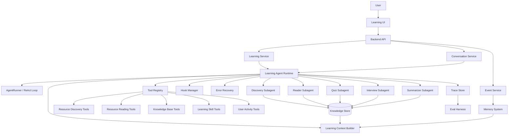
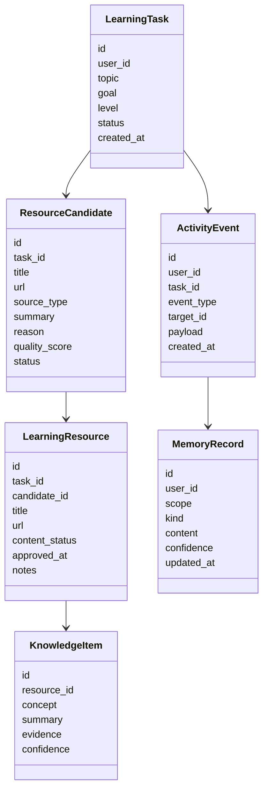
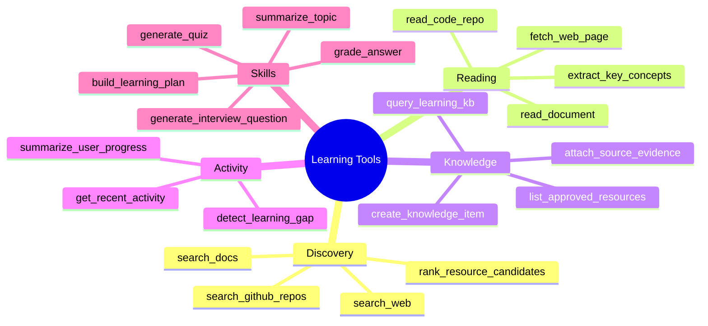
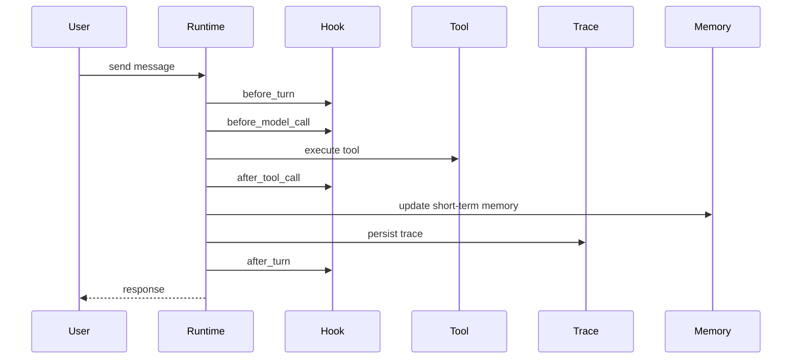
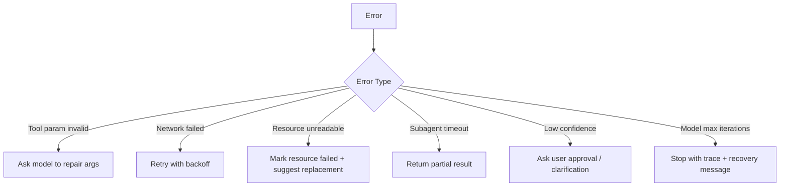
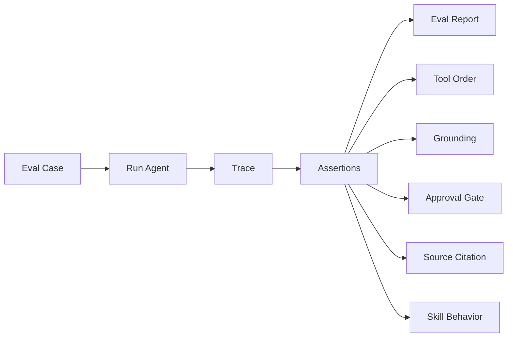

# Learning Digital Human Development Roadmap

> 初始路线图（2026-06 起草），记录基于 ScholarMate 数字人 demo 改造学习型数字人的架构讨论。
> 执行顺序已按依赖关系调整，见 [architecture.md](architecture.md)。原始文档中已过时的章节
> （指向旧仓库的代码树、日期已过的甘特图、已拍板的 Next Discussion Topics）已裁去或并入对应文档。

This document records the initial architecture discussion for building a learning-oriented digital human based on the current ScholarMate digital human demo.

## Overall Direction

The learning digital human should not be treated as a simple reskin of the scholar digital human. The current repository is best used as a reference implementation for an Agent Runtime: a manually written ReAct loop, dynamic tool mounting, progressive context disclosure, subagent execution, task persistence, references, and conversation history.

The learning scenario should get its own domain layer.

```text
Learning goal input
  -> resource discovery
  -> user approval
  -> initial knowledge base construction
  -> user learning activity tracking
  -> agent dispatches skills, tools, and subagents
  -> quizzes, interview questions, summaries, route updates
  -> eval, trace, memory, and recovery improve the system over time
```

The core product is not only a chatbot. It should be an observable, recoverable, and evaluable learning Agent Runtime.

## Recommended Architecture



## Core Domain Model

Do not start with a complex vector database. First make the structured model clear.



## Subagent Plan

Do not add subagents only for the sake of being multi-agent. Introduce a subagent when the task boundary is clear, the context can be isolated, and the output can be verified.

| Subagent | Responsibility | Trigger | Output |
| --- | --- | --- | --- |
| Discovery Subagent | Finds blogs, official docs, repos, courses | After user creates a learning task | `ResourceCandidate[]` |
| Reader Subagent | Deep reads approved resources | After approval or when user asks detailed questions | Summary, concepts, evidence, citations |
| Quiz Subagent | Generates exercises from read material | After user studies or asks for quiz mode | Questions, answers, source evidence |
| Interview Subagent | Runs interview-style questioning | When interview skill is enabled | Question sequence, scoring, follow-ups |
| Summarizer Subagent | Produces learning notes/articles | After resource reading or user request | Summary article, concept tree |
| Planner Subagent | Adjusts learning route | When progress or gaps change | Next-step learning recommendation |

The main agent should handle conversation and orchestration. Subagents should handle isolated, verifiable work.

## Tool Plan



MVP tools can be much smaller:

```text
search_learning_resources
approve_resource
read_resource_deep
list_learning_resources
generate_quiz
generate_summary
get_recent_activity
```

Later expansions can add GitHub repository reading, official documentation priority ranking, coding exercise generation, and source quality scoring.

## Hook System

The hook system is important for making the runtime solid. Avoid scattering callbacks across the codebase. Define an explicit lifecycle.



Recommended hook points:

```text
before_turn
after_turn
before_model_call
after_model_call
before_tool_call
after_tool_call
on_tool_error
on_subagent_start
on_subagent_done
on_memory_update
on_eval_sample
```

Early hooks can be no-op implementations. The important part is to stabilize the interface early.

## Memory System

Do not merge all memory into one generic table. Separate memory by purpose.

```text
1. Session Memory
   Short-term context from the current conversation and JSONL history.

2. Learning Memory
   User progress inside a learning task: mastered concepts, weak concepts, completed resources.

3. Preference Memory
   User preferences: interview-style learning, quiz preference, summary length, language preference.

4. Resource Memory
   Resource summaries, concepts, citations, and quality judgments.
```

SQLite plus JSON payload is enough for the first version. A vector database can be introduced later when resource volume and retrieval requirements justify it.

## Error Recovery

Learning agents depend on many external operations: web fetching, search, repository reading, model tool calls, and subagent tasks. Add a `RecoveryPolicy` early.



Errors should be written into trace records. They should not only be returned as strings to the model.

## Eval Harness

Eval should be planned early, even if the first version is simple. The key capability is deterministic replay.



Initial eval cases:

| Case | Assertion |
| --- | --- |
| User asks to learn React Server Components | Agent discovers resources first and does not directly build the knowledge base |
| User rejects a resource | Rejected resource must not enter context |
| User asks details about a blog | Agent must call `read_resource_deep` before answering |
| User enables interview skill | Agent should generate interview questions, not a normal summary |
| User answers a quiz incorrectly | Weak concept should be recorded into Learning Memory |
| Web fetch fails | Resource should be marked failed and replacement should be suggested |

## MVP Scope（已确认）

Narrow first scope: user enters a technical learning direction; agent finds resources; user approves; agent generates a learning route, quiz, and summary.

For stable development and eval, the first version can use a mock resource provider or manually supplied URLs. Real search can be added as a second-phase tool.

The main recommendation is to build the Agent Runtime skeleton, approval gate, trace, and eval extension points before adding many tools.
