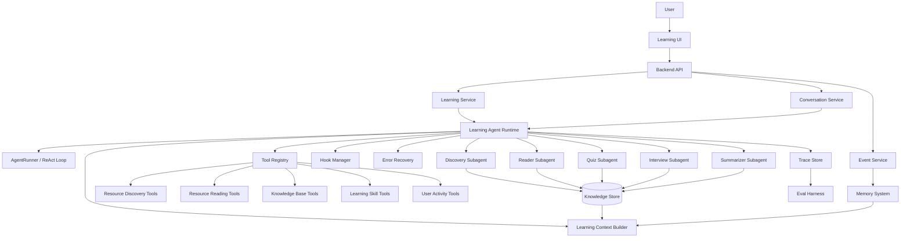
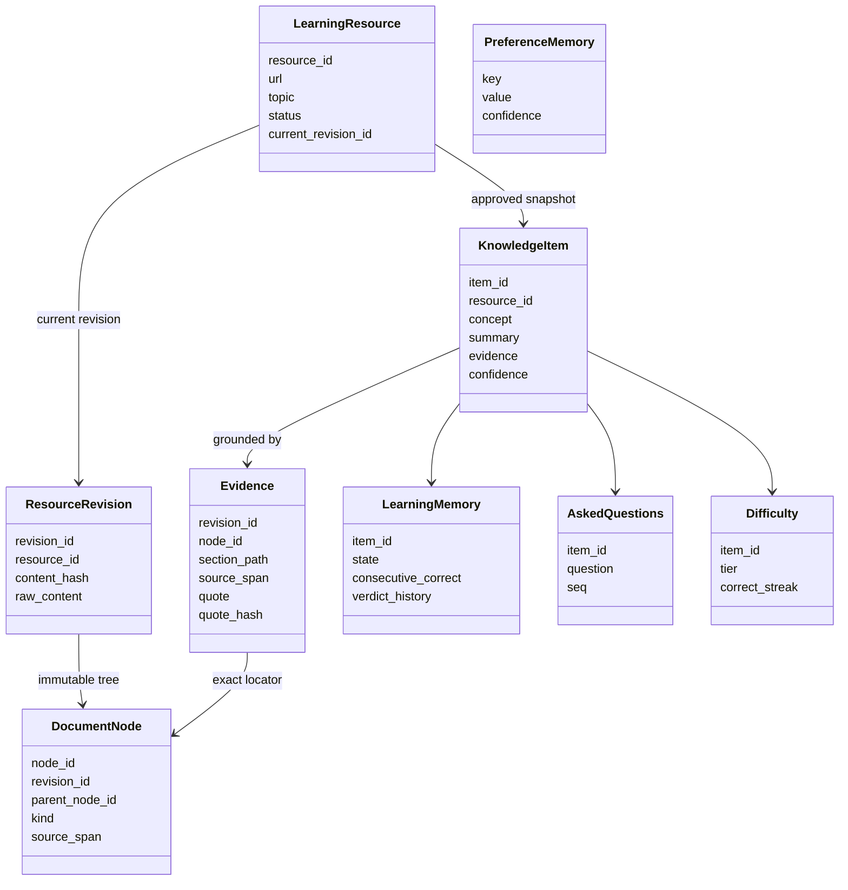
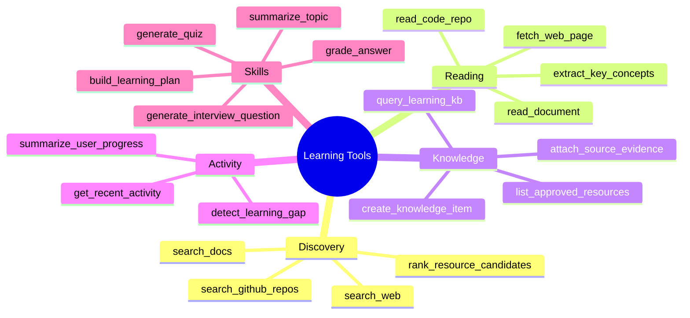
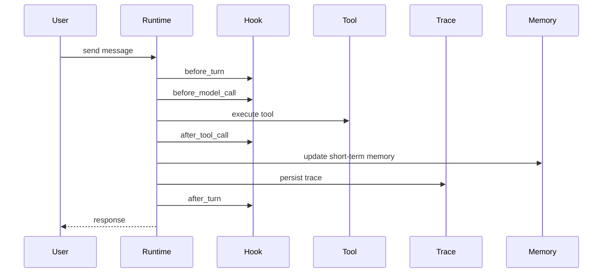
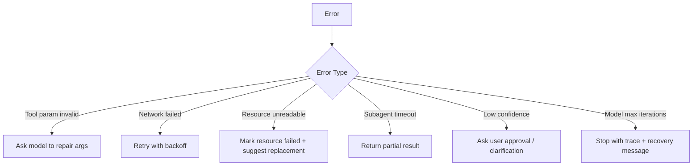
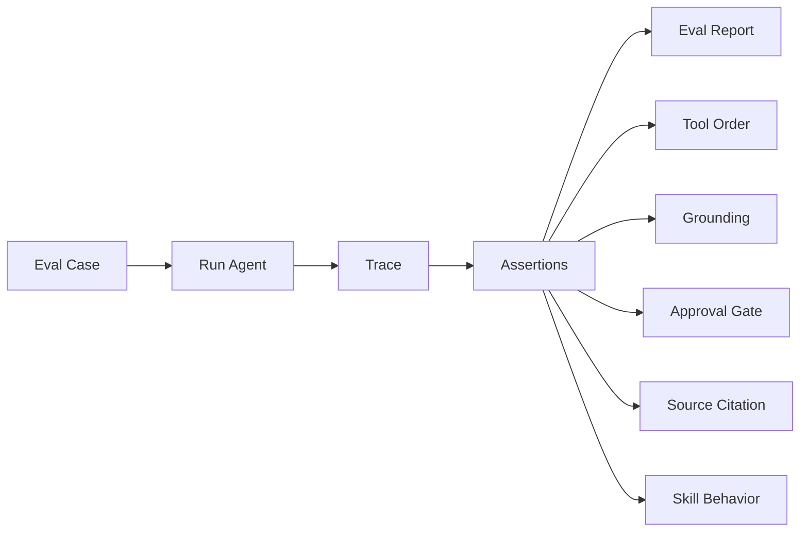

# TheGrandQuiz Development Roadmap

> 文档职责：本文件记录未来阶段与验收顺序。产品定义以 [product.md](product.md) 为准，领域实体以
> [domain-model.md](domain-model.md) 为准，架构边界以 [architecture.md](architecture.md) 和
> [ADR](adr/) 为准。本文保留的早期方案用于解释路线来源，不覆盖这些当前权威文档；已完成工作的
> 详细证据进入 [devrecords/](devrecords/)。

## 已完成：Learning Model v2 基础闭环

设计基线与基础实现已完成，当前事实如下：

1. `LearningFactJournal + transactional outbox` 已落地，完整 Trace 可独立删除。
2. `AssessmentAttemptV1`、append-only 判决纠正与确定性 reconciliation 已落地。
3. v1 受控词表、分类 proposal/审核、TagCandidate/TagAssignment 与入库原子接线已落地；规则输出默认
   proposed，只有人工批准分类可以通过 v0.3 facet consumer 驱动考核筛选。
4. 窄版 `LearnerProjectionV1`、只读 API 与稳定本地审查导出已落地；销账/复发、信心校准与错因统计后置。
5. 人工 DemandValidation 已落地；自动 Judge 仍须先通过 calibration gate。
6. AnswerDiagnosis/Misconception 晋升和新指标驱动选题仍由 Eval gate 阻挡。

ApplicabilityAssertion 仅保留契约；CompetencyBlueprint、复习排期、主动发现、知识关系与实时双工数字人继续后置。
详细字段见 [domain-model.md](domain-model.md)，长期事实边界见
[ADR-0010](adr/0010-durable-learning-facts-separate-from-operational-trace.md)。
判卷候选的受限 Required Claims 契约见
[ADR-0011](adr/0011-bounded-required-claims-for-grading.md)。

## 已完成：v0.2 功能 RC 收口

本轮完成了可靠性与既有契约收口：CommonMark 可见 Evidence 唯一映射回 raw source，Acquisition
失败以安全 `code / stage / reason` 贯通 Trace、API、CLI 与 Web。多题考核统一为
`AssessmentPlan`，开放题已统一为带评分点与题目级参考作答的 `QuestionSpec`；CLI/Web/FastAPI
conformance tests 防止题型与判卷反馈再次漂移。功能 RC 已关闭，不再追加功能；正式版本号、tag、
GitHub Release 与安装包由独立发布动作完成。包版本已进入 `0.2.0` 发布准备态；正式 tag/Release 仍以
[发布清单](open-source-release-checklist.md) 为准。完整证据见
[v0.2 功能 RC 收口](devrecords/24-v020-functional-rc-closeout.md)。

## 代码 RC 已完成：v0.3 证据闭环

v0.3 已完成三个窄消费者：人工批准的知识分类可在 Web 考核前筛选范围；人工盲标 harness 直接校准
生产逐点评判器并统计误判、重试与 Token；用户判决纠正可导出为明确标记隐私审核和非盲标属性的本地 Eval
候选。完整实现记录见 [v0.3 证据闭环](devrecords/25-v030-evidence-loop.md)。

这里的质量 gate 专指“能否把当前模型判卷策略当成足够稳定的无人值守策略”，不是软件版本能否作为
local-first 早期版本发布。代码 RC 不等于该模型策略 gate 已通过。首批 20 条真实独立答卷已完成 owner
终审，其中 19 条进入 eligible
Dataset Snapshot，1 条因 rubric overconstraint 显式排除。第一次生产校准得到 63.16% verdict agreement、
79.17% point accuracy、0 次严重跨档误判、1 次结构重试和 66,894 tokens，质量门按设计失败。其后的收窄已
完成：Report v2 保存安全运行身份与逐题审计字段；QuestionSpec 可预注册核心评分点，最终三值由代码聚合；
DeepSeek/DashScope thinking 方言分离；本地 cassette 支持逐请求 checkpoint/replay；固定 10 条开发样本的
Flash/Pro × thinking 2×2 pilot 已完成。当前候选是 `deepseek-v4-pro + thinking off`，但开发集不能充当新的
release holdout。随后的 12 条独立答卷确认该候选仍未过门（81.25% 逐点准确率、50% 三值一致率）；
误差主要来自同义表达召回不足与对未写细节的过度推断。当前收口为：生产 Grader 逐点绑定学习者答案
原文片段，Calibration Report 升级 v3，并用实现前冻结的合成挑战集做定向回归。复测将已见 12 条
开发误差集的逐点准确率提升到 87.50%、三值一致率提升到 66.67%，但 Token 增加 28.11%且仍未过门；
对四个残余分歧的 append-only 人工裁决又将公平口径修订为 89.58% / 75.00%，但该 cohort 已用于开发，
仍不具备自动策略晋升资格。v3.1 在同模型、同 cohort 的真实复测中保持全部 48 个逐点决定不变，人工裁决口径仍为
89.58% / 75.00%、严重 FN/FP 为 0/0，同时总 Token 从 25,530 降至 21,596（-15.41%）；
合成挑战 12/12 通过，但已被强制投影为 exploratory / `insufficient_evidence`。随后冻结的 12 条新真实
blind holdout 在 Pro/Thinking Off 上仅得到 68.75% 逐点准确率、58.33% 三值一致率和 3 个 serious FN，
判卷策略 gate 失败；已见开发集的改善不能外推。下一步先分离评分点 acceptance semantics 与说明示例，并
消除自由复制 Evidence 导致的结构失败。Evidence 可靠性补丁已移除 80 字诱导、加入连续原文约束与
可操作重试，并用 Report v4 分列合法输出率和合法输出上的语义质量。真实开发回归中最终合法输出率从
91.67% 升至 100%，重试从 2 降至 1，但首轮 H10 仍使用省略号；统一合法输出口径后新旧逐点准确率均为
75%，不能视为语义质量改善。随后完成的真实小型 prototype 表明：把自由复制 Evidence 改为唯一答案
单元 ID 后，首轮合法输出由 11/12 提升为 12/12、重试由 1 降为 0、Token 下降 10.73%，逐点语义指标
保持不变。该契约现已进入生产 Grader：代码切分并校验 ID，模型只选择，报告/UI 继续读取由代码解析的
精确原文；全量 Python 与离线 Replay 均通过。随后 4 条已揭盲样本的 acceptance-semantics prototype
验证 nested `all_of/any_of` 虽修复 H02/H10 并正确表达 H07，却只有 3/4 合法输出、4 次重试、24,019
tokens；flat baseline 为 4/4 合法、0 重试、6,275 tokens。H08 还暴露“把参考实现示例升格为必答条件”的
过约束，因此生产继续使用 flat atomic ExpectedPoint，只加强出题 authoring/lint，不新增 Boolean rubric
schema。实验同时发现同 key 的多次随机 retry 会覆盖 cassette；Record/Replay 现改为有序响应序列，旧单条
fixture 继续可读。flat rubric authoring guard 已落地；答卷来源现固定为
`unassisted_human / assisted_human / model / synthetic_oracle`，后三种即使人工标注也只能 exploratory。
首批 Synthetic Respondents 已在 12 道揭盲 Development Gold 题上生成 30 条 DeepSeek V4 Pro / Thinking
Off 答卷（12 完整 / 12 部分 / 6 合理误区），共 7,665 Token，只用于提前发现 failure mode。Holdout 03
仍必须另用至少 20 个新 QuestionSpec 收集 24–30 条独立人类答卷；首批 10 个新 QuestionSpec / 40 个
原子评分点已经冻结并通过固定源码 Evidence 逐字校验，owner 首批答卷也已锁定，后续由朋友体验补齐。
30 条模型答卷的 assistant screening 已完成（对 6 / 勉强 12 / 错 12），但仍需 owner 复核 6 组 rubric
边界。owner 的 10 条独立闭卷答卷也已锁定，并接受 Codex 的对 3 / 勉强 5 / 错 2 初筛；确定性编译得到
10 条 eligible / 0 excluded，全部来源均为 `unassisted_human`。生产 Grader 尚未运行；不能拿模型答卷、
已揭盲开发集或只有 10 条答卷的首批新题宣布发布质量。第二批 GQ4-H11–H20 的 10 个新 QuestionSpec /
40 个原子评分点也已独立冻结并通过 Evidence、排重与防泄漏校验，两批题目合计达到 20 个新
QuestionSpec。owner 的第二批 10 条闭卷答卷现已锁定，Codex 初筛为对 5 / 勉强 5 /
错 0，owner 随后接受全部初筛，第二批编译得到 10 eligible / 0 excluded。两批合计为 20 个新题、
80 个评分点和 20 条 eligible（对 8 / 勉强 10 / 错 2）；Compilation 已拆开 `question_id` 与独立答卷
`sample_id`，同题多位答题者不会互相覆盖。两位朋友随后各自闭卷完成 5 条自然答案，owner 接受逐点初筛；
正式 cohort 达到 30 条人类答卷、20 个 unique QuestionSpec、120 个逐点评判（对 17 / 勉强 11 / 错 2）。
本地隐私审核冻结的 30 eligible / 0 exploratory Dataset Snapshot
`71a504b0725e41e9992e217de1daf89429f1b126faaa281c7d8822558d306743` 已运行固定 DeepSeek V4 Pro /
Thinking Off 正式 gate。合法输出率 100%、逐点准确率 90.83%、严重 FN/FP 0/0 均通过，但三值一致率
25/30 = 83.33% 低于 85%，因此 gate 按设计失败。五个分歧均为单点 false negative，集中在组合表达、
等价机制和非参考实现名的语义召回；该 cohort 已揭盲，只能作为 Development Gold。下一步先做小型
contrastive entailment prototype，胜出后仍需新的未见人类 Holdout。2026-08-04 的四组原型均未同时满足
“修回至少 4/5、零新增逐点错误、Token 增幅不超过 15%”，因此没有继续堆 Prompt。当前生产候选改为
受限数据契约：ExpectedPoint 保持扁平，新增 1–3 条固定 all-of 的 `required_claims`，逐 claim 绑定答案
Evidence 并由代码聚合；仍禁止任意 `all_of/any_of` Boolean tree。该实现只打开新的验证路径，不改变
Holdout 03 的失败结论。2026-08-06 的真实 Development Gold 原型进一步得到 12/12 合法输出，但 verdict
仅从 7/12 到 8/12、point 仍为 37/48、新增六个逐点分歧，Token 增加 50.68%；预注册契约失败。
因此暂不消耗新的未见人类 QuestionSpec/答卷，required claims 只保留为可审计实验 seam。随后在已见
开发集预注册并真实运行“紧凑 claim 输出 + 仅对改变三值的 missing claim 聚焦复核”：紧凑首阶段解决
4/4 个高影响目标，并以 18,561 Token 低于 flat baseline；但 5 次聚焦复核没有修复任何错误，反而新增
一个 point false positive，使 aligned point 从 37/43 降到 36/43、三值从 9/12 降到 8/12。该路线按
预注册退出条件否决，不再叠加 Judge、放宽阈值或消耗新 holdout。代码收口已把新题生成与默认判卷恢复为
flat atomic ExpectedPoint + AnswerEvidenceUnit ID；显式载入或历史 cassette 返回的 claims 仍可兼容回放，
claim-aware 分支只保留兼容与实验入口。下一候选是一次用户可见的判卷澄清：纯领域 planner/state machine
已能只选择会改变三值的 uncertain missing point，并强制一次补充、一次重判后停止；但 Holdout 03 的
30 条生产报告中 diagnosis 分布为 complete 13 / missing_key_point 15 / off_topic 2 / uncertain 0，现有
触发信号不可用，因此尚未接入 AssessmentSession、CLI/Web 或 Learning Memory。随后冻结的 12 个决定性
missing point 二分类原型得到合法 12/12、找回 2/5、误追问 1/7、precision 66.67%、9,587 Token，未过
预注册门。误差证明 grading Gold 不能直接充当 Interaction Gold：答案直接支持但初判冲突、答案存在真实
歧义、答案确实缺失必须拆成三态。owner 已接受 12 条独立三态 Interaction Gold（6 / 2 / 4）；第二轮
Support Relationship 原型真实得到合法 11/12、exact 9/12、no support 5/6、ambiguity 0/2、direct
support 4/4、3 次重试、12,342 Token，预注册失败。自动 ambiguity 信号继续关闭；direct-support
abstention 与用户主动澄清若继续推进，必须作为新的窄实验，不能从本轮直接上线。

自动澄清仍按上述结论关闭；其旁路的**用户主动申诉竖切已完成**：开放题允许一次补充，原答不可变，按同一
rubric 重判并经追加式 Verdict Correction 重放学习状态。它解决“模型误解后用户无法解释”的体验问题，
不计作自动 Interaction classifier 的质量提升。见
[用户主动补充与判卷申诉竖切](devrecords/42-user-initiated-assessment-appeal.md)。
完整证据见 [Grader 语义匹配收口](devrecords/29-grading-semantic-matcher-closeout.md) 和
[Evidence 契约可靠性补丁](devrecords/30-grading-evidence-contract-reliability.md) 和
[答案 Evidence 单元生产化](devrecords/31-grading-answer-evidence-units.md) 和
[Benchmark 规模与 acceptance semantics 收口](devrecords/32-grading-benchmark-and-replay-sequences.md) 和
[答卷来源隔离与 Synthetic Respondents](devrecords/33-answer-provenance-and-synthetic-respondents.md) 和
[Holdout 03 正式 Release Gate](devrecords/34-holdout-03-release-gate.md) 和
[Required Claims 真实开发集原型](devrecords/37-required-claims-development-gold-prototype.md) 和
[紧凑 Claims 与聚焦复核真实原型](devrecords/38-compact-claim-focused-review-prototype.md) 和
[flat 基座回撤与一次性判卷澄清 seam](devrecords/39-flat-grading-and-clarification-seam.md) 和
[判卷澄清二分类原型](devrecords/40-clarification-signal-prototype.md) 和
[三态 Support Relationship 真实原型](devrecords/41-support-relationship-prototype.md)。未达到新 holdout gate 前，自动 Judge、
Diagnosis/Misconception、能力蓝图和自适应选题继续只保留在文档或 proposal 层。
批量入库、Reader batch 并发、candidate-level LLM repair 和 Trace explain 也没有进入本轮。

## 代码 RC 已完成：v0.4 人工授权的发现与数据晋升

v0.4 没有越过尚未通过的质量 gate，而是把两条“候选 → 人工决定 → 既有可信路径”做完整：

1. 显式学习主题经已配置的 SearchProvider 产生持久候选；搜索阶段不 fetch、不调用 Reader、不写 KB。
2. 材料批准复用 Acquisition 的控制 token、状态机、错误信封与二次知识点审批；拒绝不会产生副作用。
3. 最新判决纠正与人工盲标进入本地 Eval inbox；替换版本 supersede 旧候选，不修改来源事实。
4. 只有 active + approved 候选可组成按内容哈希标识的不可变快照；盲标 eligible 与纠正 exploratory 分列。
5. Web 提供发现历史、材料审核、盲标 JSON 导入、敏感内容折叠审核和快照结果；关键决定进入事件脊柱。

完整证据见 [v0.4 人工授权闭环](devrecords/26-v040-human-approved-discovery.md)；首批真实数据集的编译、
隐私审批和 Snapshot 证据见 [真实判卷校准准备](devrecords/27-real-grading-calibration-preparation.md)。生产
Grader calibration 已完成首次真实运行但未通过，完整证据和下一步见同一记录。自动策略 quality gate
未通过前不启用
自动入库、自动数据晋升、定时发现或学习策略。

## 已完成：v0.4.0 软件发布收口

v0.4.0 的发布对象是上述人工授权工作流和可纠正的 local-first 产品，不是“判卷模型已经达到无人监督可靠”。
发布前只处理版本一致性、v0.2 数据升级兼容、浏览器申诉链、安装产物、文档与回归门；不再新增功能。
模型策略 gate 的失败作为已知限制公开，默认仍保留 exact Evidence、逐点评判、用户一次申诉和 Trace 审计。
当前发布动作见 [v0.4.0 发布清单](open-source-release-checklist-v0.4.0.md)。

## 已完成：v0.5 Voice Interview 软件收口

Prototype 01 已证明桌面 Chromium 的 WebM/Opus 完整录音可以不转码交给
`qwen-audio-3.0-asr-flash`，37.275 秒真实样本的 Provider 往返约 2.026 秒；术语增强对词表内术语有效，
因此 v0.5 进入正式实现。完整设计见 [Voice Interview 设计契约](design/v050-voice-interview.md)，不可逆的答案
权威边界见 [ADR-0012](adr/0012-voice-transcript-is-reviewable-input.md)。

按依赖顺序交付五个窄竖切；截至 2026-08-12，五项均已完成：

1. revision-scoped RecognitionLexicon 与 exact-item TranscriptionHints；
2. Provider 中立转写 seam、DashScope Adapter 与离线 Replay；
3. 持久 VoiceRun、幂等/取消/显式重试/重启收敛和 FastAPI；
4. 桌面 Web 录音、回放、上传、草稿审查与唯一 Assessment 提交；
5. Trace 安全投影、Scenario Bot、Standards/Spec 双轴审查、四条固定音频的 hints off/on 真实 dogfood 与
   8/8 离线 replay 已完成；词表正样本改善 `ReAct / AgentEvent / PageIndex`，负样本和自然回答零术语插入。

本轮不实现实时 WebSocket、TTS、双工 Interview Agent、数字人形象、转码、移动端兼容、LLM 口语清理或生产
录音数据飞轮。术语增强已经通过本轮固定音频门，但仍保留显式开关（环境变量首次默认 + Web 持久热更新）；四条样本不能替代通用
CER/WER 或噪声鲁棒性评测。

v0.5.0 发布只冻结这条“完整录音 → 可编辑草稿 → 既有 Assessment”竖切，以及随本轮一同验收的桌面工作区
与上下文预算观测；不继续追加实时语音或数据飞轮。当前发布动作见
[v0.5.0 发布清单](open-source-release-checklist-v0.5.0.md)。

This document records the initial architecture discussion for building an assessment-driven,
observable, recoverable, and evaluable learning agent.

## 历史方向基线

The product should not be treated as a chatbot reskin. Its engineering core is an Agent Runtime with
a manually controlled ReAct loop, dynamic tool mounting, progressive context disclosure, subagent
execution, task persistence, references, and conversation history.

The learning scenario should get its own domain layer.

```text
Learning goal input
  -> resource discovery
  -> user approval
  -> initial knowledge base construction
  -> user learning activity tracking
  -> agent dispatches skills, tools, and subagents
  -> quizzes, interview questions, summaries, route updates
  -> eval, trace, memory, and recovery improve the system over time
```

The core product is not only a chatbot. It should be an observable, recoverable, and evaluable learning Agent Runtime.

## Recommended Architecture



## Core Domain Model

Do not start with a complex vector database. First make the structured model clear.



当前模型以稳定 locator 标识 `LearningResource`，以不可变 `ResourceRevision` 表达获批内容版本；
`DocumentNode` 保存确定性文档树，`Evidence` 精确锚定 revision/node/source span。全局 KB 不按标题
分区，Learning Memory、AskedQuestions 与 Difficulty 均锚定稳定的 `KnowledgeItem.item_id`。

## Subagent Plan

Do not add subagents only for the sake of being multi-agent. Introduce a subagent when the task boundary is clear, the context can be isolated, and the output can be verified.

| Subagent | Responsibility | Trigger | Output |
| --- | --- | --- | --- |
| Discovery Subagent | Finds blogs, official docs, repos, courses | After user creates a learning task | `ResourceCandidate[]` |
| Reader Subagent | Deep reads approved resources | After approval or when user asks detailed questions | Summary, concepts, evidence, citations |
| Quiz Subagent | Generates exercises from read material | After user studies or asks for quiz mode | Questions, answers, source evidence |
| Interview Subagent | Runs interview-style questioning | When interview skill is enabled | Question sequence, scoring, follow-ups |
| Summarizer Subagent | Produces learning notes/articles | After resource reading or user request | Summary article, concept tree |
| Planner Subagent | Adjusts learning route | When progress or gaps change | Next-step learning recommendation |

The main agent should handle conversation and orchestration. Subagents should handle isolated, verifiable work.

> 2026-06-13 收敛（架构审视）：判据硬化为"隔离大上下文 + 输出可结构化验证"。按此判据，
> **MVP 唯一 subagent 是 Reader**；出题（generate_quiz）、判卷（grade_answer）是带 schema 的
> **工具**，不是 subagent。上表 Discovery / Quiz / Interview / Summarizer / Planner 降为二期候选，
> 逐个按判据再立项。核心考核循环是确定性 workflow（见 architecture.md 核心设计判断二），
> 不是多 subagent 编排。

## Tool Plan



MVP tools can be much smaller:

```text
search_learning_resources
approve_resource
read_resource_deep
list_learning_resources
generate_quiz
generate_summary
get_recent_activity
```

> 2026-06-13 按考核竖切收敛 MVP 实际工具集：`approve_resource`、`read_resource_deep`（经 Reader
> subagent）、`list_knowledge_items`、`generate_quiz`（出题，工具）、`grade_answer`（判卷，工具）、
> `get_recent_activity`。`search_learning_resources` / `generate_summary` 随发现 / 总结环节移入二期。

Later expansions can add GitHub repository reading, official documentation priority ranking, coding exercise generation, and source quality scoring.

## Hook System

The hook system is important for making the runtime solid. Avoid scattering callbacks across the codebase. Define an explicit lifecycle.



Recommended hook points:

```text
before_turn
after_turn
before_model_call
after_model_call
before_tool_call
after_tool_call
on_tool_error
on_subagent_start
on_subagent_done
on_memory_update
on_eval_sample
```

Early hooks can be no-op implementations. The important part is to stabilize the interface early.

## Memory System

Do not merge all memory into one generic table. Separate memory by purpose.

```text
1. Session Memory
   Short-term context from the current conversation and JSONL history.

2. Learning Memory
   User progress inside a learning task: mastered concepts, weak concepts, completed resources.

3. Preference Memory
   User preferences: interview-style learning, quiz preference, summary length, language preference.

4. Resource Memory
   Resource summaries, concepts, citations, and quality judgments.
```

> 2026-06-13 收敛（ADR-0003）：上述四分库收为两类——MVP 只实现 **Learning + Preference**；
> Resource Memory 并入 KnowledgeItem（不重复造实体），Session Memory 归 kernel 会话历史（非 domain 记忆）。

SQLite plus JSON payload is enough for the first version. A vector database can be introduced later when resource volume and retrieval requirements justify it.

## Error Recovery

Learning agents depend on many external operations: web fetching, search, repository reading, model tool calls, and subagent tasks. Add a `RecoveryPolicy` early.



Errors should be written into trace records. They should not only be returned as strings to the model.

## Eval Harness

Eval should be planned early, even if the first version is simple. The key capability is deterministic replay.

当前实现（2026-07-21）已有 17 条 Tier-1 用例，并给 case15 自然材料回答增加了首条 Tier-2 `grounded_answer` 质量门；case16 断网回放 Web Acquisition 接口与失败零污染，case17 回放真实模型的 search → 用户选择 → ingest 决策。Tier-2 在参与 pass/fail 前必须先复现 4 个人工标注 calibration samples；真实结果由显式脚本录制，默认 harness 与 HTML 报告只做离线 Replay。Rule/Quality verdict、被测 workflow 成本与 judge 成本分开统计，未声明 quality profile 的 16 条用例显示 N/A 且不调用 judge。



Initial eval cases（2026-06-12 改为考核竖切 8 例，全部跑在 trace 上）：

| # | Case | Assertion |
| --- | --- | --- |
| 1 | 深读产出未经审批 | 未审批的 KnowledgeItem 不得入库 |
| 2 | 空库时"考我" | Agent 拒绝出题并引导用户先喂资源，不凭空编题 |
| 3 | 出题 | 每道题锚定存在的 KnowledgeItem，且其 evidence 非空 |
| 4 | 答错一道题 | 对应薄弱概念按 item id 写入 Learning Memory |
| 5 | 复考选题 | 出的题 ∈ 代码构造的"薄弱优先"候选集（候选集按薄弱优先构造，LLM 在集内自由挑；有薄弱概念时新概念不进集） |
| 6 | 答对薄弱题 | 第一次答对 → 薄弱转"观察中"（仍在表内）；连续第二次答对 → 销账移出 |
| 7 | 深读 fetch 失败 | 资源标记失败，不产生幽灵 KnowledgeItem |
| 8 | 题型路由 | 首次接触概念出选择题，薄弱概念复考走追问 |

> 旧用例中 discovery（"先发现再建库"）、interview skill、换源建议三例随发现/面试环节移入二期。
> "拒绝资源不入上下文"并入用例 1（审批语义）。

## MVP Scope（已确认，2026-06-12 修订为考核竖切）

> 修订背景：产品定位明确为"考核驱动的个人学习工具"（见根目录 CONTEXT.md），
> 核心循环是考核，路线规划与总结降为配角——原"路线 + quiz + 总结三件套"出 MVP。

MVP 是一条穿透考核循环的竖切：

```text
手动喂 URL → 审批 → Reader 深读入库（带出处）→ "考我" → 出题带证据
→ 判卷 → 薄弱概念入 Learning Memory → 复考时优先薄弱点
```

这条竖切已穿透全部 runtime 能力：审批门、subagent、grounding、结构化输出、记忆、trace/replay。

For stable development and eval, the first version uses manually supplied URLs (mock resource
provider). Real search/discovery, learning-route planning, and summaries are second-phase.

The main recommendation is unchanged: build the Agent Runtime skeleton, approval gate, trace, and
eval extension points before adding many tools.

## Local Web 后续竖切

LW-S1–S5 已交付 Article、Chat、Assessment、Trace Observatory 与 Web Acquisition 主路径。后续只保留
两条稳定方向；
个人开发的具体执行项默认记录在 gitignored 的 `.scratch/`，有协作者参与时再把稳定事项发布为
GitHub Issues：

1. **LW-S7：v0.1.0 发布门**——把生产 React build 作为明确的 package/release artifact，由 FastAPI
   同源托管；验证 loopback 启动、静态资源打包、OpenAPI drift、前后端 CI、installed-wheel smoke、
   隐私说明与真实 dogfood。功能 RC 已补齐 Provider 原生 delta → AgentEvent → Chat SSE 的流式链、
   turn-scoped 取消、空状态示例和版本化首次引导；它们不依赖下面两项。
2. **LW-S5：Web Acquisition 与可恢复审批（✅ v0.1.0）**——上传 Markdown/Text 或输入公开 URL →
   Fetch → Reader → 候选审批已投影到 Web；run 持久化为固定六态，`needs_input` 可在服务重启后凭单次、
   可过期 token 恢复并原子提交。失败、取消和审批前均保持零 KB 污染；网络搜索候选继续由 ReAct
   `web_search` 承担，不在管理抽屉重复造搜索产品。
3. **LW-S6：资源、知识点与学习轨迹管理（v0.1.0 后）**——提供 article/revision/KnowledgeItem/
   Evidence 浏览、安全资源操作、三态学习轨迹、配置状态和数据备份说明。页面是领域行为与 trace 的
   投影，不做 SQLite 表格管理器，也不通过 API 回传 secret value。

LW-S6 是否进入下一版本，由首轮小范围体验反馈决定；在证据出现前不阻塞 v0.1.0。

## 未来方向（潜在扩展，"可达不堵死"，非 MVP）

> 2026-06-15 记录，基于对 [Ontos-AI/knowhere](https://github.com/Ontos-AI/knowhere) 的调研 + 一次对抗式设计审查。
> 原则：最好的前向兼容是好的当前边界，不是投机接口——只埋"retrofit 贵 + 预留近乎免费 + 当前会堵死"的种子。

### 文档结构与轻量知识图谱：分层演进，成本/可信度各不同

> 2026-07-17：长文 Reader 预算红灯证明“原文 blob + 临时 token 分块”不足以支撑稳定深读。ADR-0008 已接受。
> 以下 Layer 1 从旧称“资源内概念树”纠正为“文档结构树”：
> section 父子关系表达作者如何组织原文，不能自动推导概念上下位或 prerequisite。

关键教训（对标 [GitNexus](https://github.com/abhigyanpatwari/GitNexus)：纯 Tree-sitter AST、零 LLM 建
`CALLS/IMPORTS/EXTENDS` 边；[graphify](https://github.com/safishamsi/graphify)：代码走 AST、仅文档
fallback LLM 语义抽取且给边打 `EXTRACTED/INFERRED/AMBIGUOUS` 置信标签）：**便宜可靠的边来自可确定性抽取
的"结构"，LLM 三元组抽取是昂贵且噪的 fallback，只在没有结构信号时才用**。代码有 AST，我们的散文学习材料
没有——对应的"廉价结构"是文档层级（section 树），语义边才需要 LLM。

- **Layer 0 — ResourceRevision（确定性 source 层，DS-S1–S4 已实现）**：LearningResource 继续是稳定 locator；
  每次获批内容形成不可变 revision，保存当时原文与 content_hash。当前 revision 进入默认搜索/考核，旧 revision
  只供历史 trace 与 citation 解析，重 ingest 不再让旧引用失去原文。
- **Layer 1 — DocumentNode tree（便宜可靠的结构层，DS-S1–S4 已实现）**：Markdown 标题、段落、表格、列表和代码块由代码
  确定性解析为带 source span 的父子树；`section_path` 是可读路径，`node_id` 才是身份。SQLite adjacency rows +
  recursive CTE + FTS5 支撑“大纲 → 稀疏搜索 → 展开节点 → 精确正文”，不需要 LLM 决定结构。
- **Layer 2 — KnowledgeItem + grounding（DS-S2/DS-S3 已实现）**：Reader 从自然节点提取 item；每条 evidence
  必须锚定 revision、node 和精确 span，并由代码核对 quote。KnowledgeItem 身份继续遵守 ADR-0002/0007，
  DocumentNode 不能替代 item，一个 item 可跨节点、一个节点也可产多个 item。
- **Layer 3 — KnowledgeRelation（DS-S5，LLM 推断、eval 门控且当前关闭）**：Reader 只在已抽取 item 集合内提出
  prerequisite / related / contradicts，边是带 confidence、evidence provenance、prompt version、trace id 和
  review status 的普通 SQLite 行。前置知识感知选题或多跳问答对基线有稳定提升才保留；section 层级不得自动
  升格为语义边。
- **Layer 4 — 跨资源 CanonicalConcept（推迟）**：ADR-0002 的 `concept_key`、aliases 与规则式重叠只提供
  候选信号。未来若立项，CanonicalConcept 以 represented_by 聚合多个 source-grounded item，是可撤销投影，
  不覆盖 KnowledgeItem、不自动迁移 Learning Memory。

**eval 门控是回答"值不值"的成熟解法**：Layer 2 建在检索 / 选题缝后，加一个 eval 用例——"前置知识感知
选题" vs "纯薄弱优先"基线，在薄弱概念解决率 / 出题相关性上是否有提升，跑 trace 量化，有提升才留。这把
"SPO 图值不值这个成本"从玄学变成 A/B 数字，是本项目该秀的差异化肌肉。

**纪律**：ResourceRevision、DocumentNode 和精确 evidence 是当前要落地的 source-of-truth 基座；
KnowledgeRelation 是独立实验 issue，不能为“以后也许有图”阻塞基础树和搜索交付。关系不藏 metadata JSON，
也不提前建立全局 Concept。**不采纳**：Leiden 社区检测（GraphRAG 血统，太重）、图数据库
（Neo4j/FalkorDB/LadybugDB）、向量库以及 Knowhere 重运行时。

### 其他方向（延续前几轮讨论）

- 入库 Reader 按 DocumentNode 自然节点确定性覆盖全文；开放 ReAct / Summarizer 使用 PageIndex 式
  “读大纲 → 搜索 → 选章节 → 展开正文”。两者共享同一 Document Structure module，但只有开放路径由 LLM
  决定读取分支，核心考核 workflow 不改为自由 ReAct。
- 开放/定时任务 → 拉取相关资料 → 生成推送摘要 → 用户挑感兴趣的 → 进学习-考核-复习循环：复用
  ResourceCandidate + 审批门原语 + ADR-0004 的自由 ReAct（开放编排）+ interfaces 通道（定时触发即又一通道）。

### 明确不采纳（避免走偏）

向量库 / embedding、GraphRAG 式 LLM 实体抽取 + 社区检测、knowhere 的整套重运行时
（Postgres/Redis/S3/worker 等）、MinerU/VLM 多模态栈、大规模跨文档图导航。ADR-0009 采用的本机
FastAPI + React interface 不等于引入这套基础设施。差异化卖点押在可观测/可评测
（trace/replay/eval），而非再造一个 RAG 壳。

### 待办的两笔工程性备注

- **EventSink 异常隔离**：per-observer try/except 隔离在 M4 HookManager 落（events.py 已加 docstring 说明）。
- **并发下的 seq 定序**：建 subagent 并发（M4+）时，工具顺序断言改用 parent_span 因果树而非全局 seq。
