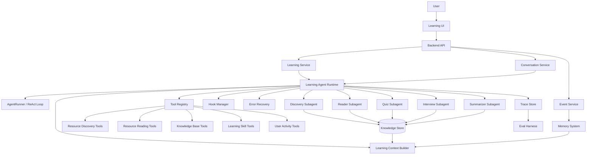
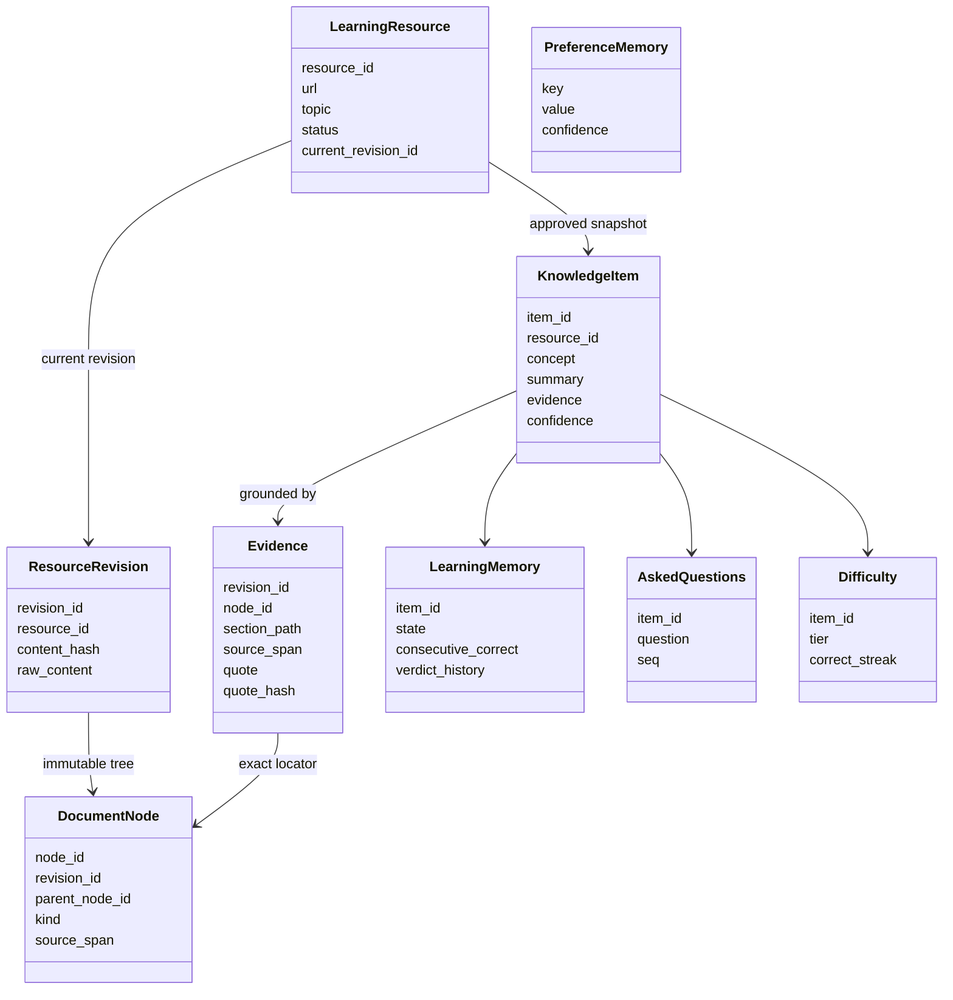
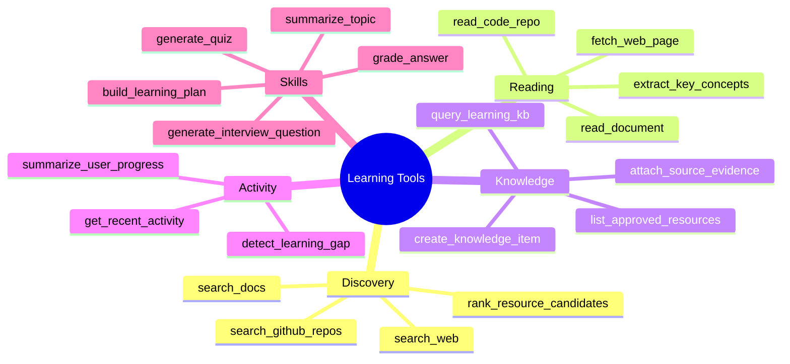
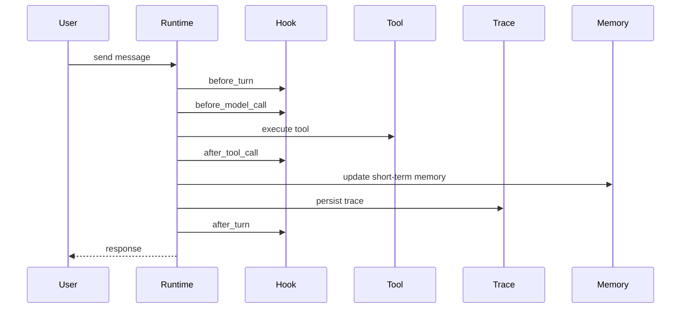
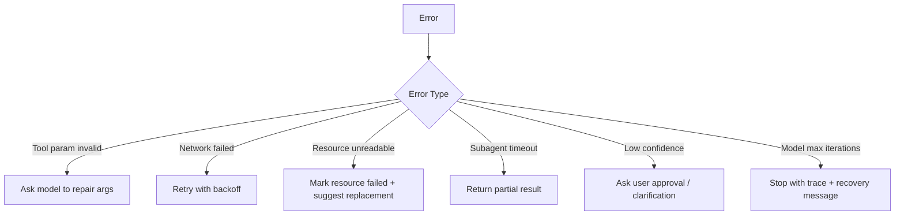
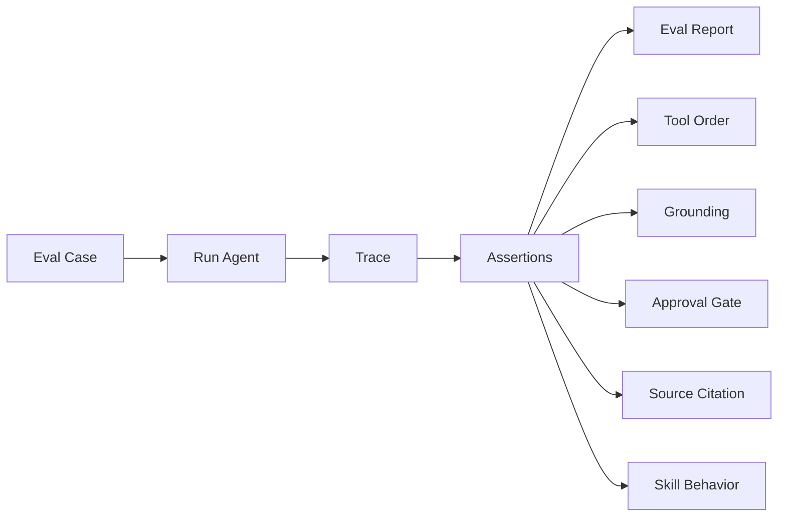

# TheGrandQuiz Development Roadmap

> 初始路线图（2026-06 起草），记录学习型 Agent 从实验骨架走向考核驱动产品的架构讨论。
> 执行顺序已按依赖关系调整，见 [architecture.md](architecture.md)。已经失效的代码树、日期甘特图和
> 已拍板议题已裁去或并入对应文档。

This document records the initial architecture discussion for building an assessment-driven,
observable, recoverable, and evaluable learning agent.

## Overall Direction

The product should not be treated as a chatbot reskin. Its engineering core is an Agent Runtime with
a manually controlled ReAct loop, dynamic tool mounting, progressive context disclosure, subagent
execution, task persistence, references, and conversation history.

The learning scenario should get its own domain layer.

```text
Learning goal input
  -> resource discovery
  -> user approval
  -> initial knowledge base construction
  -> user learning activity tracking
  -> agent dispatches skills, tools, and subagents
  -> quizzes, interview questions, summaries, route updates
  -> eval, trace, memory, and recovery improve the system over time
```

The core product is not only a chatbot. It should be an observable, recoverable, and evaluable learning Agent Runtime.

## Recommended Architecture



## Core Domain Model

Do not start with a complex vector database. First make the structured model clear.



当前模型以稳定 locator 标识 `LearningResource`，以不可变 `ResourceRevision` 表达获批内容版本；
`DocumentNode` 保存确定性文档树，`Evidence` 精确锚定 revision/node/source span。全局 KB 不按标题
分区，Learning Memory、AskedQuestions 与 Difficulty 均锚定稳定的 `KnowledgeItem.item_id`。

## Subagent Plan

Do not add subagents only for the sake of being multi-agent. Introduce a subagent when the task boundary is clear, the context can be isolated, and the output can be verified.

| Subagent | Responsibility | Trigger | Output |
| --- | --- | --- | --- |
| Discovery Subagent | Finds blogs, official docs, repos, courses | After user creates a learning task | `ResourceCandidate[]` |
| Reader Subagent | Deep reads approved resources | After approval or when user asks detailed questions | Summary, concepts, evidence, citations |
| Quiz Subagent | Generates exercises from read material | After user studies or asks for quiz mode | Questions, answers, source evidence |
| Interview Subagent | Runs interview-style questioning | When interview skill is enabled | Question sequence, scoring, follow-ups |
| Summarizer Subagent | Produces learning notes/articles | After resource reading or user request | Summary article, concept tree |
| Planner Subagent | Adjusts learning route | When progress or gaps change | Next-step learning recommendation |

The main agent should handle conversation and orchestration. Subagents should handle isolated, verifiable work.

> 2026-06-13 收敛（架构审视）：判据硬化为"隔离大上下文 + 输出可结构化验证"。按此判据，
> **MVP 唯一 subagent 是 Reader**；出题（generate_quiz）、判卷（grade_answer）是带 schema 的
> **工具**，不是 subagent。上表 Discovery / Quiz / Interview / Summarizer / Planner 降为二期候选，
> 逐个按判据再立项。核心考核循环是确定性 workflow（见 architecture.md 核心设计判断二），
> 不是多 subagent 编排。

## Tool Plan



MVP tools can be much smaller:

```text
search_learning_resources
approve_resource
read_resource_deep
list_learning_resources
generate_quiz
generate_summary
get_recent_activity
```

> 2026-06-13 按考核竖切收敛 MVP 实际工具集：`approve_resource`、`read_resource_deep`（经 Reader
> subagent）、`list_knowledge_items`、`generate_quiz`（出题，工具）、`grade_answer`（判卷，工具）、
> `get_recent_activity`。`search_learning_resources` / `generate_summary` 随发现 / 总结环节移入二期。

Later expansions can add GitHub repository reading, official documentation priority ranking, coding exercise generation, and source quality scoring.

## Hook System

The hook system is important for making the runtime solid. Avoid scattering callbacks across the codebase. Define an explicit lifecycle.



Recommended hook points:

```text
before_turn
after_turn
before_model_call
after_model_call
before_tool_call
after_tool_call
on_tool_error
on_subagent_start
on_subagent_done
on_memory_update
on_eval_sample
```

Early hooks can be no-op implementations. The important part is to stabilize the interface early.

## Memory System

Do not merge all memory into one generic table. Separate memory by purpose.

```text
1. Session Memory
   Short-term context from the current conversation and JSONL history.

2. Learning Memory
   User progress inside a learning task: mastered concepts, weak concepts, completed resources.

3. Preference Memory
   User preferences: interview-style learning, quiz preference, summary length, language preference.

4. Resource Memory
   Resource summaries, concepts, citations, and quality judgments.
```

> 2026-06-13 收敛（ADR-0003）：上述四分库收为两类——MVP 只实现 **Learning + Preference**；
> Resource Memory 并入 KnowledgeItem（不重复造实体），Session Memory 归 kernel 会话历史（非 domain 记忆）。

SQLite plus JSON payload is enough for the first version. A vector database can be introduced later when resource volume and retrieval requirements justify it.

## Error Recovery

Learning agents depend on many external operations: web fetching, search, repository reading, model tool calls, and subagent tasks. Add a `RecoveryPolicy` early.



Errors should be written into trace records. They should not only be returned as strings to the model.

## Eval Harness

Eval should be planned early, even if the first version is simple. The key capability is deterministic replay.

当前实现（2026-07-21）已有 17 条 Tier-1 用例，并给 case15 自然材料回答增加了首条 Tier-2 `grounded_answer` 质量门；case16 断网回放 Web Acquisition 接口与失败零污染，case17 回放真实模型的 search → 用户选择 → ingest 决策。Tier-2 在参与 pass/fail 前必须先复现 4 个人工标注 calibration samples；真实结果由显式脚本录制，默认 harness 与 HTML 报告只做离线 Replay。Rule/Quality verdict、被测 workflow 成本与 judge 成本分开统计，未声明 quality profile 的 16 条用例显示 N/A 且不调用 judge。



Initial eval cases（2026-06-12 改为考核竖切 8 例，全部跑在 trace 上）：

| # | Case | Assertion |
| --- | --- | --- |
| 1 | 深读产出未经审批 | 未审批的 KnowledgeItem 不得入库 |
| 2 | 空库时"考我" | Agent 拒绝出题并引导用户先喂资源，不凭空编题 |
| 3 | 出题 | 每道题锚定存在的 KnowledgeItem，且其 evidence 非空 |
| 4 | 答错一道题 | 对应薄弱概念按 item id 写入 Learning Memory |
| 5 | 复考选题 | 出的题 ∈ 代码构造的"薄弱优先"候选集（候选集按薄弱优先构造，LLM 在集内自由挑；有薄弱概念时新概念不进集） |
| 6 | 答对薄弱题 | 第一次答对 → 薄弱转"观察中"（仍在表内）；连续第二次答对 → 销账移出 |
| 7 | 深读 fetch 失败 | 资源标记失败，不产生幽灵 KnowledgeItem |
| 8 | 题型路由 | 首次接触概念出选择题，薄弱概念复考走追问 |

> 旧用例中 discovery（"先发现再建库"）、interview skill、换源建议三例随发现/面试环节移入二期。
> "拒绝资源不入上下文"并入用例 1（审批语义）。

## MVP Scope（已确认，2026-06-12 修订为考核竖切）

> 修订背景：产品定位明确为"考核驱动的个人学习工具"（见根目录 CONTEXT.md），
> 核心循环是考核，路线规划与总结降为配角——原"路线 + quiz + 总结三件套"出 MVP。

MVP 是一条穿透考核循环的竖切：

```text
手动喂 URL → 审批 → Reader 深读入库（带出处）→ "考我" → 出题带证据
→ 判卷 → 薄弱概念入 Learning Memory → 复考时优先薄弱点
```

这条竖切已穿透全部 runtime 能力：审批门、subagent、grounding、结构化输出、记忆、trace/replay。

For stable development and eval, the first version uses manually supplied URLs (mock resource
provider). Real search/discovery, learning-route planning, and summaries are second-phase.

The main recommendation is unchanged: build the Agent Runtime skeleton, approval gate, trace, and
eval extension points before adding many tools.

## Local Web 后续竖切

LW-S1–S4 已交付 Article、Chat、Assessment 与 Trace Observatory 主路径。后续只保留三条稳定方向，
具体执行项进入 GitHub Issues：

1. **LW-S7：v0.1.0 发布门**——把生产 React build 作为明确的 package/release artifact，由 FastAPI
   同源托管；验证 loopback 启动、静态资源打包、OpenAPI drift、前后端 CI、installed-wheel smoke、
   隐私说明与真实 dogfood。功能 RC 已补齐 Provider 原生 delta → AgentEvent → Chat SSE 的流式链、
   turn-scoped 取消、空状态示例和版本化首次引导；它们不依赖下面两项。
2. **LW-S5：Web Acquisition 与可恢复审批（v0.1.0 后）**——把既有 Search → 用户选择 → Fetch →
   Reader 投影到 Web；审批 run 必须持久化为 `needs_input`，服务重启后仍可凭单次、可过期 token
   恢复并原子提交。质量失败不能触发 Reader、审批或 KB 写入。
3. **LW-S6：资源、知识点与学习轨迹管理（v0.1.0 后）**——提供 article/revision/KnowledgeItem/
   Evidence 浏览、安全资源操作、三态学习轨迹、配置状态和数据备份说明。页面是领域行为与 trace 的
   投影，不做 SQLite 表格管理器，也不通过 API 回传 secret value。

LW-S5/LW-S6 是否进入下一版本，由首轮小范围体验反馈决定；在证据出现前不阻塞 v0.1.0。

## 未来方向（潜在扩展，"可达不堵死"，非 MVP）

> 2026-06-15 记录，基于对 [Ontos-AI/knowhere](https://github.com/Ontos-AI/knowhere) 的调研 + 一次对抗式设计审查。
> 原则：最好的前向兼容是好的当前边界，不是投机接口——只埋"retrofit 贵 + 预留近乎免费 + 当前会堵死"的种子。

### 文档结构与轻量知识图谱：分层演进，成本/可信度各不同

> 2026-07-17：长文 Reader 预算红灯证明“原文 blob + 临时 token 分块”不足以支撑稳定深读。ADR-0008 已接受。
> 以下 Layer 1 从旧称“资源内概念树”纠正为“文档结构树”：
> section 父子关系表达作者如何组织原文，不能自动推导概念上下位或 prerequisite。

关键教训（对标 [GitNexus](https://github.com/abhigyanpatwari/GitNexus)：纯 Tree-sitter AST、零 LLM 建
`CALLS/IMPORTS/EXTENDS` 边；[graphify](https://github.com/safishamsi/graphify)：代码走 AST、仅文档
fallback LLM 语义抽取且给边打 `EXTRACTED/INFERRED/AMBIGUOUS` 置信标签）：**便宜可靠的边来自可确定性抽取
的"结构"，LLM 三元组抽取是昂贵且噪的 fallback，只在没有结构信号时才用**。代码有 AST，我们的散文学习材料
没有——对应的"廉价结构"是文档层级（section 树），语义边才需要 LLM。

- **Layer 0 — ResourceRevision（确定性 source 层，DS-S1–S4 已实现）**：LearningResource 继续是稳定 locator；
  每次获批内容形成不可变 revision，保存当时原文与 content_hash。当前 revision 进入默认搜索/考核，旧 revision
  只供历史 trace 与 citation 解析，重 ingest 不再让旧引用失去原文。
- **Layer 1 — DocumentNode tree（便宜可靠的结构层，DS-S1–S4 已实现）**：Markdown 标题、段落、表格、列表和代码块由代码
  确定性解析为带 source span 的父子树；`section_path` 是可读路径，`node_id` 才是身份。SQLite adjacency rows +
  recursive CTE + FTS5 支撑“大纲 → 稀疏搜索 → 展开节点 → 精确正文”，不需要 LLM 决定结构。
- **Layer 2 — KnowledgeItem + grounding（DS-S2/DS-S3 已实现）**：Reader 从自然节点提取 item；每条 evidence
  必须锚定 revision、node 和精确 span，并由代码核对 quote。KnowledgeItem 身份继续遵守 ADR-0002/0007，
  DocumentNode 不能替代 item，一个 item 可跨节点、一个节点也可产多个 item。
- **Layer 3 — KnowledgeRelation（DS-S5，LLM 推断、eval 门控且当前关闭）**：Reader 只在已抽取 item 集合内提出
  prerequisite / related / contradicts，边是带 confidence、evidence provenance、prompt version、trace id 和
  review status 的普通 SQLite 行。前置知识感知选题或多跳问答对基线有稳定提升才保留；section 层级不得自动
  升格为语义边。
- **Layer 4 — 跨资源 CanonicalConcept（推迟）**：ADR-0002 的 `concept_key`、aliases 与规则式重叠只提供
  候选信号。未来若立项，CanonicalConcept 以 represented_by 聚合多个 source-grounded item，是可撤销投影，
  不覆盖 KnowledgeItem、不自动迁移 Learning Memory。

**eval 门控是回答"值不值"的成熟解法**：Layer 2 建在检索 / 选题缝后，加一个 eval 用例——"前置知识感知
选题" vs "纯薄弱优先"基线，在薄弱概念解决率 / 出题相关性上是否有提升，跑 trace 量化，有提升才留。这把
"SPO 图值不值这个成本"从玄学变成 A/B 数字，是本项目该秀的差异化肌肉。

**纪律**：ResourceRevision、DocumentNode 和精确 evidence 是当前要落地的 source-of-truth 基座；
KnowledgeRelation 是独立实验 issue，不能为“以后也许有图”阻塞基础树和搜索交付。关系不藏 metadata JSON，
也不提前建立全局 Concept。**不采纳**：Leiden 社区检测（GraphRAG 血统，太重）、图数据库
（Neo4j/FalkorDB/LadybugDB）、向量库以及 Knowhere 重运行时。

### 其他方向（延续前几轮讨论）

- 入库 Reader 按 DocumentNode 自然节点确定性覆盖全文；开放 ReAct / Summarizer 使用 PageIndex 式
  “读大纲 → 搜索 → 选章节 → 展开正文”。两者共享同一 Document Structure module，但只有开放路径由 LLM
  决定读取分支，核心考核 workflow 不改为自由 ReAct。
- 开放/定时任务 → 拉取相关资料 → 生成推送摘要 → 用户挑感兴趣的 → 进学习-考核-复习循环：复用
  ResourceCandidate + 审批门原语 + ADR-0004 的自由 ReAct（开放编排）+ interfaces 通道（定时触发即又一通道）。

### 明确不采纳（避免走偏）

向量库 / embedding、GraphRAG 式 LLM 实体抽取 + 社区检测、knowhere 的整套重运行时
（Postgres/Redis/S3/worker 等）、MinerU/VLM 多模态栈、大规模跨文档图导航。ADR-0009 采用的本机
FastAPI + React interface 不等于引入这套基础设施。差异化卖点押在可观测/可评测
（trace/replay/eval），而非再造一个 RAG 壳。

### 待办的两笔工程性备注

- **EventSink 异常隔离**：per-observer try/except 隔离在 M4 HookManager 落（events.py 已加 docstring 说明）。
- **并发下的 seq 定序**：建 subagent 并发（M4+）时，工具顺序断言改用 parent_span 因果树而非全局 seq。
