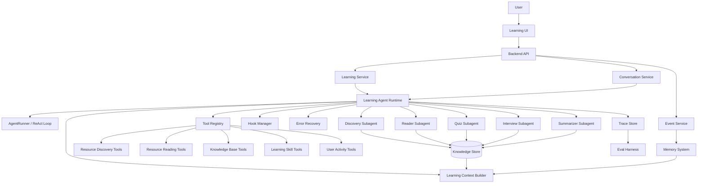
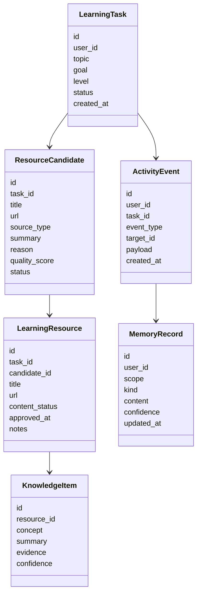
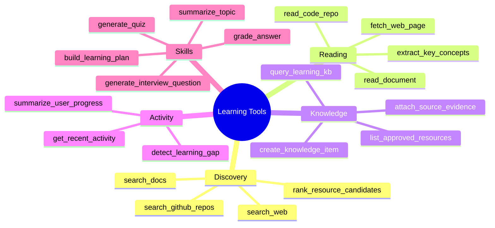
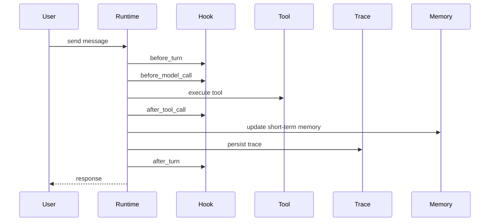
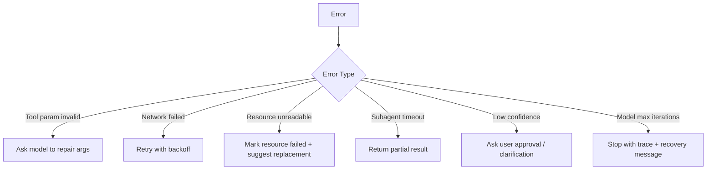
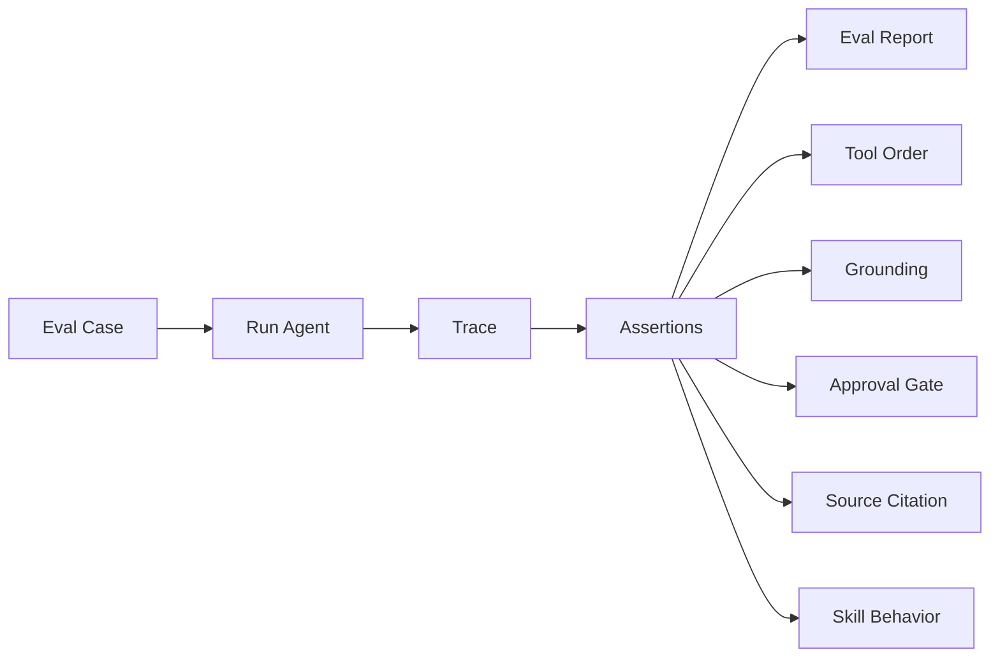

# Learning Digital Human Development Roadmap

> 初始路线图（2026-06 起草），记录基于 ScholarMate 数字人 demo 改造学习型数字人的架构讨论。
> 执行顺序已按依赖关系调整，见 [architecture.md](architecture.md)。原始文档中已过时的章节
> （指向旧仓库的代码树、日期已过的甘特图、已拍板的 Next Discussion Topics）已裁去或并入对应文档。

This document records the initial architecture discussion for building a learning-oriented digital human based on the current ScholarMate digital human demo.

## Overall Direction

The learning digital human should not be treated as a simple reskin of the scholar digital human. The current repository is best used as a reference implementation for an Agent Runtime: a manually written ReAct loop, dynamic tool mounting, progressive context disclosure, subagent execution, task persistence, references, and conversation history.

The learning scenario should get its own domain layer.

```text
Learning goal input
  -> resource discovery
  -> user approval
  -> initial knowledge base construction
  -> user learning activity tracking
  -> agent dispatches skills, tools, and subagents
  -> quizzes, interview questions, summaries, route updates
  -> eval, trace, memory, and recovery improve the system over time
```

The core product is not only a chatbot. It should be an observable, recoverable, and evaluable learning Agent Runtime.

## Recommended Architecture



## Core Domain Model

Do not start with a complex vector database. First make the structured model clear.



> 2026-06-15 领域模型精化（保持 ADR-0002）：KnowledgeItem 的 `evidence` 落为 `{quote, locator|None}`
> 结构（locator 携 section_path/锚点，MVP 可 None）；LearningResource 持久化原始抓取内容（blob + content_hash）。
> 二者让"出处定位符"与"资源内概念树"可事后构建而无需重抓——见 issue 03 与 reference-map（knowhere）。

## Subagent Plan

Do not add subagents only for the sake of being multi-agent. Introduce a subagent when the task boundary is clear, the context can be isolated, and the output can be verified.

| Subagent | Responsibility | Trigger | Output |
| --- | --- | --- | --- |
| Discovery Subagent | Finds blogs, official docs, repos, courses | After user creates a learning task | `ResourceCandidate[]` |
| Reader Subagent | Deep reads approved resources | After approval or when user asks detailed questions | Summary, concepts, evidence, citations |
| Quiz Subagent | Generates exercises from read material | After user studies or asks for quiz mode | Questions, answers, source evidence |
| Interview Subagent | Runs interview-style questioning | When interview skill is enabled | Question sequence, scoring, follow-ups |
| Summarizer Subagent | Produces learning notes/articles | After resource reading or user request | Summary article, concept tree |
| Planner Subagent | Adjusts learning route | When progress or gaps change | Next-step learning recommendation |

The main agent should handle conversation and orchestration. Subagents should handle isolated, verifiable work.

> 2026-06-13 收敛（架构审视）：判据硬化为"隔离大上下文 + 输出可结构化验证"。按此判据，
> **MVP 唯一 subagent 是 Reader**；出题（generate_quiz）、判卷（grade_answer）是带 schema 的
> **工具**，不是 subagent。上表 Discovery / Quiz / Interview / Summarizer / Planner 降为二期候选，
> 逐个按判据再立项。核心考核循环是确定性 workflow（见 architecture.md 核心设计判断二），
> 不是多 subagent 编排。

## Tool Plan



MVP tools can be much smaller:

```text
search_learning_resources
approve_resource
read_resource_deep
list_learning_resources
generate_quiz
generate_summary
get_recent_activity
```

> 2026-06-13 按考核竖切收敛 MVP 实际工具集：`approve_resource`、`read_resource_deep`（经 Reader
> subagent）、`list_knowledge_items`、`generate_quiz`（出题，工具）、`grade_answer`（判卷，工具）、
> `get_recent_activity`。`search_learning_resources` / `generate_summary` 随发现 / 总结环节移入二期。

Later expansions can add GitHub repository reading, official documentation priority ranking, coding exercise generation, and source quality scoring.

## Hook System

The hook system is important for making the runtime solid. Avoid scattering callbacks across the codebase. Define an explicit lifecycle.



Recommended hook points:

```text
before_turn
after_turn
before_model_call
after_model_call
before_tool_call
after_tool_call
on_tool_error
on_subagent_start
on_subagent_done
on_memory_update
on_eval_sample
```

Early hooks can be no-op implementations. The important part is to stabilize the interface early.

## Memory System

Do not merge all memory into one generic table. Separate memory by purpose.

```text
1. Session Memory
   Short-term context from the current conversation and JSONL history.

2. Learning Memory
   User progress inside a learning task: mastered concepts, weak concepts, completed resources.

3. Preference Memory
   User preferences: interview-style learning, quiz preference, summary length, language preference.

4. Resource Memory
   Resource summaries, concepts, citations, and quality judgments.
```

> 2026-06-13 收敛（ADR-0003）：上述四分库收为两类——MVP 只实现 **Learning + Preference**；
> Resource Memory 并入 KnowledgeItem（不重复造实体），Session Memory 归 kernel 会话历史（非 domain 记忆）。

SQLite plus JSON payload is enough for the first version. A vector database can be introduced later when resource volume and retrieval requirements justify it.

## Error Recovery

Learning agents depend on many external operations: web fetching, search, repository reading, model tool calls, and subagent tasks. Add a `RecoveryPolicy` early.



Errors should be written into trace records. They should not only be returned as strings to the model.

## Eval Harness

Eval should be planned early, even if the first version is simple. The key capability is deterministic replay.



Initial eval cases（2026-06-12 改为考核竖切 8 例，全部跑在 trace 上）：

| # | Case | Assertion |
| --- | --- | --- |
| 1 | 深读产出未经审批 | 未审批的 KnowledgeItem 不得入库 |
| 2 | 空库时"考我" | Agent 拒绝出题并引导用户先喂资源，不凭空编题 |
| 3 | 出题 | 每道题锚定存在的 KnowledgeItem，且其 evidence 非空 |
| 4 | 答错一道题 | 对应薄弱概念按 item id 写入 Learning Memory |
| 5 | 复考选题 | 出的题 ∈ 代码构造的"薄弱优先"候选集（候选集按薄弱优先构造，LLM 在集内自由挑；有薄弱概念时新概念不进集） |
| 6 | 答对薄弱题 | 第一次答对 → 薄弱转"观察中"（仍在表内）；连续第二次答对 → 销账移出 |
| 7 | 深读 fetch 失败 | 资源标记失败，不产生幽灵 KnowledgeItem |
| 8 | 题型路由 | 首次接触概念出选择题，薄弱概念复考走追问 |

> 旧用例中 discovery（"先发现再建库"）、interview skill、换源建议三例随发现/面试环节移入二期。
> "拒绝资源不入上下文"并入用例 1（审批语义）。

## MVP Scope（已确认，2026-06-12 修订为考核竖切）

> 修订背景：产品定位明确为"考核驱动的个人学习工具"（见根目录 CONTEXT.md），
> 核心循环是考核，路线规划与总结降为配角——原"路线 + quiz + 总结三件套"出 MVP。

MVP 是一条穿透考核循环的竖切：

```text
手动喂 URL → 审批 → Reader 深读入库（带出处）→ "考我" → 出题带证据
→ 判卷 → 薄弱概念入 Learning Memory → 复考时优先薄弱点
```

这条竖切已穿透全部 runtime 能力：审批门、subagent、grounding、结构化输出、记忆、trace/replay。

For stable development and eval, the first version uses manually supplied URLs (mock resource
provider). Real search/discovery, learning-route planning, and summaries are second-phase.

The main recommendation is unchanged: build the Agent Runtime skeleton, approval gate, trace, and
eval extension points before adding many tools.

## 未来方向（潜在扩展，"可达不堵死"，非 MVP）

> 2026-06-15 记录，基于对 [Ontos-AI/knowhere](https://github.com/Ontos-AI/knowhere) 的调研 + 一次对抗式设计审查。
> 原则：最好的前向兼容是好的当前边界，不是投机接口——只埋"retrofit 贵 + 预留近乎免费 + 当前会堵死"的种子。

### 轻量知识图谱：分四层，成本/时机各不同

关键教训（对标 [GitNexus](https://github.com/abhigyanpatwari/GitNexus)：纯 Tree-sitter AST、零 LLM 建
`CALLS/IMPORTS/EXTENDS` 边；[graphify](https://github.com/safishamsi/graphify)：代码走 AST、仅文档
fallback LLM 语义抽取且给边打 `EXTRACTED/INFERRED/AMBIGUOUS` 置信标签）：**便宜可靠的边来自可确定性抽取
的"结构"，LLM 三元组抽取是昂贵且噪的 fallback，只在没有结构信号时才用**。代码有 AST，我们的散文学习材料
没有——对应的"廉价结构"是文档层级（section 树），语义边才需要 LLM。

- **Layer 0 — 知识点（已在建，M3.1）**：Reader 抽取 → 摘要 + `section_path`。抽取产出精简摘要当索引
  （而非 embedding→向量），是"无向量库 / agentic 检索"路线的核心。这是个领域无关抽象——学习域叫"知识点"，
  条款 / 合规域就是"规则点"（同一 kernel 换 domain 即可，验证 runtime 可复用；但本项目聚焦学习、不建 rules 域）。
- **Layer 1 — 资源内概念树（便宜的结构边，已由 provenance 预留）**：`section_path` 天然给父 / 子层级，
  零 LLM。用于按结构导航概念、按层级排考序（先基础节点、再进阶子节点）。不违反 ADR-0002。
- **Layer 2 — 概念间语义边，作为 Reader 单次遍历的副产品（eval 门控，MVP 后）**：Reader 本就把整篇读进
  隔离上下文并产 KnowledgeItem[]，在**同一次调用**顺带吐 `{from_item, relation: prerequisite|related|
  contradicts, to_item, confidence}`——是 SPO 三元组，但主体限定在已抽的 item、不另起抽取管线、带置信
  标签（graphify 式）让选题代码只信高置信边。存普通 SQLite 行（knowhere 式，不上图数据库）。启用多跳提问
  + **前置知识感知选题**（答错"useEffect 依赖"→ 发现其 prerequisite 是"闭包"→ 先补考"闭包"）。
  成本 = 现有 Reader 调用的边际 token。
- **Layer 3 — 跨资源图 / 归并（推迟）**：ADR-0002 二期 `concept_key` + knowhere 规则式重叠配方。不碰。

**eval 门控是回答"值不值"的成熟解法**：Layer 2 建在检索 / 选题缝后，加一个 eval 用例——"前置知识感知
选题" vs "纯薄弱优先"基线，在薄弱概念解决率 / 出题相关性上是否有提升，跑 trace 量化，有提升才留。这把
"SPO 图值不值这个成本"从玄学变成 A/B 数字，是本项目该秀的差异化肌肉。

**纪律**：Layer 2 现在**不进 schema**（未跑通竖切前加边字段 = 过早抽象），但没被堵死——已预留的
"LearningResource 持久化原始内容"让日后对存下的原文重跑一次 Reader 即可建边，无需重抓。故作 MVP 后的
eval 门控实验，而非现在预留接口。**不采纳**：Leiden 社区检测（GraphRAG 血统，太重）、图数据库
（Neo4j/FalkorDB/LadybugDB——两仓库都提供导出但核心可移植，我们坚持 SQLite 行）、向量库。

### 其他方向（延续前几轮讨论）

- 入库/检索深化为 agentic search（PageIndex 式"读大纲→选章节"逐步单次 LLM 调用），落在预留的"检索缝"后。
- 开放/定时任务 → 拉取相关资料 → 生成推送摘要 → 用户挑感兴趣的 → 进学习-考核-复习循环：复用
  ResourceCandidate + 审批门原语 + ADR-0004 的自由 ReAct（开放编排）+ interfaces 通道（定时触发即又一通道）。

### 明确不采纳（避免走偏）

向量库 / embedding、GraphRAG 式 LLM 实体抽取 + 社区检测、knowhere 的重运行时（Postgres/Redis/S3/worker/
FastAPI monorepo）、MinerU/VLM 多模态栈、大规模跨文档图导航。差异化卖点押在可观测/可评测
（trace/replay/eval），而非再造一个 RAG 壳。

### 待办的两笔工程性备注

- **EventSink 异常隔离**：per-observer try/except 隔离在 M4 HookManager 落（events.py 已加 docstring 说明）。
- **并发下的 seq 定序**：建 subagent 并发（M4+）时，工具顺序断言改用 parent_span 因果树而非全局 seq。
